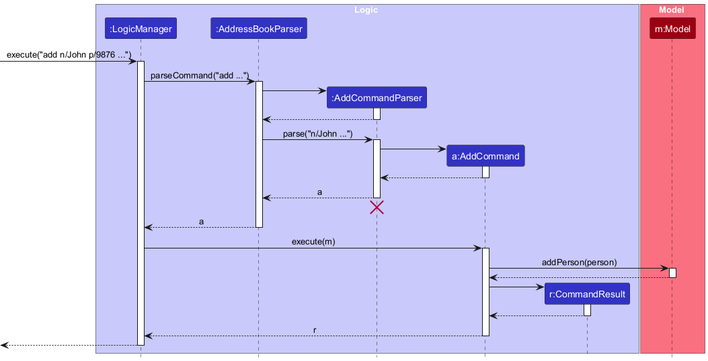
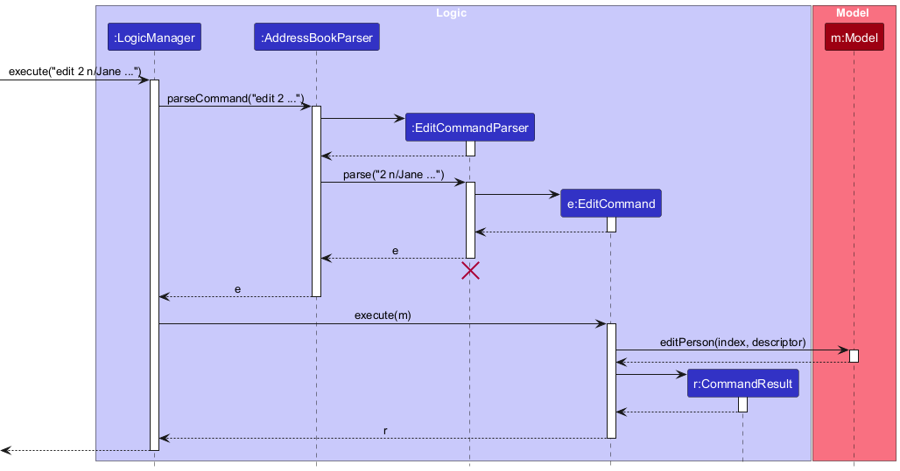
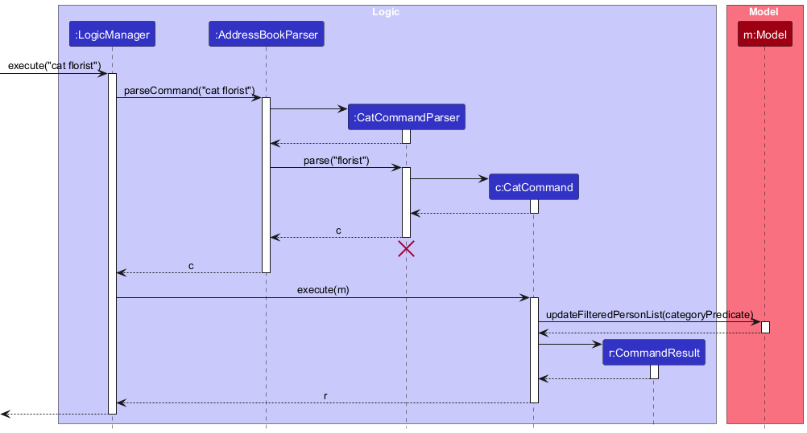
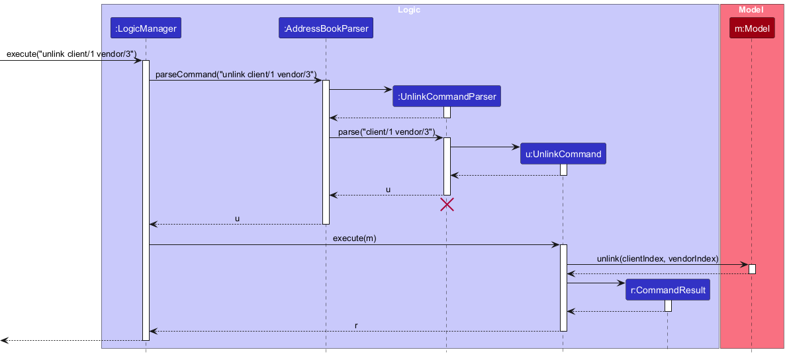
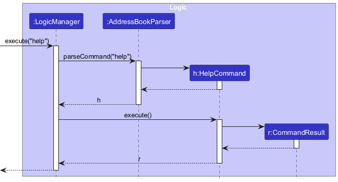

## Quick Navigation

1. [Acknowledgements](#acknowledgements)
2. [Setting up, getting started](#setting-up-getting-started)
3. [About KnotBook](#about-knotbook)
4. [Purpose of this Developer Guide](#purpose-of-this-developer-guide)
5. [Design](#design)
   - [Architecture](#architecture)
   - [UI component](#ui-component)
   - [Logic component](#logic-component)
   - [Model component](#model-component)
   - [Storage component](#storage-component)
   - [Common classes](#common-classes)
6. [Implementation](#implementation)
   - [Person Type Feature](#person-type-feature)
   - [Wedding Date Feature](#wedding-date-feature)
   - [Add Person Feature](#add-person-feature)
   - [Edit Person Feature](#edit-person-feature)
   - [Find Person Feature](#find-person-feature)
   - [Category Filter (Cat Command) Feature](#category-filter-cat-command-feature)
   - [Delete Person Feature](#delete-person-feature)
   - [Link Person Feature](#link-person-feature)
   - [Unlink Person Feature](#unlink-person-feature)
   - [Person Details Panel Rendering](#person-details-panel-rendering)
   - [Error Handling for Indices and Command Format](#error-handling-for-indices-and-command-format)
   - [Help Command Feature](#help-command-feature)
7. [Documentation, logging, testing, configuration, dev-ops](#documentation-logging-testing-configuration-dev-ops)
8. [Appendix: Requirements](#appendix-requirements)
   - [Product scope](#product-scope)
   - [User stories](#user-stories)
   - [Use cases](#use-cases)
   - [Non-Functional Requirements](#non-functional-requirements)
   - [Glossary](#glossary)
   - [KnotBook Glossary](#knotbook-glossary)
9. [Appendix: Instructions for manual testing](#appendix-instructions-for-manual-testing)
   - [Launch and shutdown](#launch-and-shutdown)
   - [Deleting a person](#deleting-a-person)
   - [Filtering contacts by category](#filtering-contacts-by-category)
   - [Linking a client to a vendor](#linking-a-client-to-a-vendor)
   - [Unlinking a client from a vendor](#unlinking-a-client-from-a-vendor)
   - [Viewing help information](#viewing-help-information)
   - [Adding a contact with person type](#adding-a-contact-with-person-type)
10. [Appendix: Planned Enhancements](#appendix-planned-enhancements)

--------------------------------------------------------------------------------------------------------------------

## **Acknowledgements**

* This project is based on the AddressBook-Level3 project created by the [SE-EDU initiative](https://se-education.org).
* Libraries used: [JavaFX](https://openjfx.io/), [Jackson](https://github.com/FasterXML/jackson), [JUnit5](https://github.com/junit-team/junit5), [Apache Commons Validator](https://commons.apache.org/proper/commons-validator/)

--------------------------------------------------------------------------------------------------------------------

## **Setting up, getting started**

Refer to the guide [_Setting up and getting started_](SettingUp.md).

--------------------------------------------------------------------------------------------------------------------

## **About KnotBook**

KnotBook is a desktop contact management application tailored for wedding planners. Built upon the SE‑EDU AddressBook Level 3 foundation, it extends the base application with wedding‑planning concepts such as distinct person types (clients and vendors), categories (e.g., florist, delivery), linking clients to vendors for specific weddings, budget and price tracking, and a details panel optimized for wedding workflows. KnotBook is designed to be fast for keyboard‑driven power users while keeping the codebase approachable and extensible for student developers.

## **Purpose of this Developer Guide**

This guide explains how KnotBook is designed and how to work within the codebase. It is written for developers who want to:

* Understand the system architecture and major components (UI, Logic, Model, Storage, Commons)
* Learn the implementation details behind key features (e.g., categories, link/unlink, details panel)
* Contribute new features while maintaining consistency with existing patterns and coding standards
* Write tests, follow logging/configuration practices, and reason about design trade‑offs

Read this guide together with the User Guide to understand the user‑facing behavior and command syntax. When in doubt, prefer the patterns documented here (e.g., parser patterns, error handling policy) to keep the codebase cohesive.

--------------------------------------------------------------------------------------------------------------------

## **Design**

<div markdown="span" class="alert alert-primary">

:bulb: **Tip:** The `.puml` files used to create diagrams are in this document `docs/diagrams` folder. Refer to the [_PlantUML Tutorial_ at se-edu/guides](https://se-education.org/guides/tutorials/plantUml.html) to learn how to create and edit diagrams.
</div>

### Architecture


The ***Architecture Diagram*** given above explains the high-level design of the App.

Given below is a quick overview of main components and how they interact with each other.

**Main components of the architecture**

**`Main`** (consisting of classes [`Main`](https://github.com/AY2526S1-CS2103T-T16-3/master/src/main/java/seedu/address/Main.java) and [`MainApp`](https://github.com/AY2526S1-CS2103T-T16-3/master/src/main/java/seedu/address/MainApp.java)) is in charge of the app launch and shut down.
* At app launch, it initializes the other components in the correct sequence, and connects them up with each other.
* At shut down, it shuts down the other components and invokes cleanup methods where necessary.

The bulk of the app's work is done by the following four components:

* [**`UI`**](#ui-component): The UI of the App.
* [**`Logic`**](#logic-component): The command executor.
* [**`Model`**](#model-component): Holds the data of the App in memory.
* [**`Storage`**](#storage-component): Reads data from, and writes data to, the hard disk.

[**`Commons`**](#common-classes) represents a collection of classes used by multiple other components.

**How the architecture components interact with each other**

The *Sequence Diagram* below shows how the components interact with each other for the scenario where the user issues the command `delete 1`.


Each of the four main components (also shown in the diagram above),

* defines its *API* in an `interface` with the same name as the Component.
* implements its functionality using a concrete `{Component Name}Manager` class (which follows the corresponding API `interface` mentioned in the previous point.

For example, the `Logic` component defines its API in the `Logic.java` interface and implements its functionality using the `LogicManager.java` class which follows the `Logic` interface. Other components interact with a given component through its interface rather than the concrete class (reason: to prevent outside component's being coupled to the implementation of a component), as illustrated in the (partial) class diagram below.


The sections below give more details of each component.

### UI component

The **API** of this component is specified in [`Ui.java`](https://github.com/AY2526S1-CS2103T-T16-3/master/src/main/java/seedu/address/ui/Ui.java)


The UI consists of a `MainWindow` that is made up of parts e.g.`CommandBox`, `ResultDisplay`, `PersonListPanel`, `StatusBarFooter` etc. All these, including the `MainWindow`, inherit from the abstract `UiPart` class which captures the commonalities between classes that represent parts of the visible GUI.

The `UI` component uses the JavaFx UI framework. The layout of these UI parts are defined in matching `.fxml` files that are in the `src/main/resources/view` folder. For example, the layout of the [`MainWindow`](https://github.com/AY2526S1-CS2103T-T16-3/master/src/main/java/seedu/address/ui/MainWindow.java) is specified in [`MainWindow.fxml`](https://github.com/AY2526S1-CS2103T-T16-3/master/src/main/resources/view/MainWindow.fxml)

The `UI` component,

* executes user commands using the `Logic` component.
* listens for changes to `Model` data so that the UI can be updated with the modified data.
* keeps a reference to the `Logic` component, because the `UI` relies on the `Logic` to execute commands.
* depends on some classes in the `Model` component, as it displays `Person` object residing in the `Model`.

### Logic component

**API** : [`Logic.java`](https://github.com/AY2526S1-CS2103T-T16-3/master/src/main/java/seedu/address/logic/Logic.java)

Here's a (partial) class diagram of the `Logic` component:


The sequence diagram below illustrates the interactions within the `Logic` component, taking `execute("delete 1")` API call as an example.


<div markdown="span" class="alert alert-info">:information_source: **Note:** The lifeline for `DeleteCommandParser` should end at the destroy marker (X) but due to a limitation of PlantUML, the lifeline continues till the end of diagram.
</div>

How the `Logic` component works:

1. When `Logic` is called upon to execute a command, it is passed to an `AddressBookParser` object which in turn creates a parser that matches the command (e.g., `DeleteCommandParser`) and uses it to parse the command.
1. This results in a `Command` object (more precisely, an object of one of its subclasses e.g., `DeleteCommand`) which is executed by the `LogicManager`.
1. The command can communicate with the `Model` when it is executed (e.g. to delete a person).<br>
   Note that although this is shown as a single step in the diagram above (for simplicity), in the code it can take several interactions (between the command object and the `Model`) to achieve.
1. The result of the command execution is encapsulated as a `CommandResult` object which is returned back from `Logic`.

Here are the other classes in `Logic` (omitted from the class diagram above) that are used for parsing a user command:


How the parsing works:
* When called upon to parse a user command, the `AddressBookParser` class creates an `XYZCommandParser` (`XYZ` is a placeholder for the specific command name e.g., `AddCommandParser`) which uses the other classes shown above to parse the user command and create a `XYZCommand` object (e.g., `AddCommand`) which the `AddressBookParser` returns back as a `Command` object.
* All `XYZCommandParser` classes (e.g., `AddCommandParser`, `DeleteCommandParser`, ...) inherit from the `Parser` interface so that they can be treated similarly where possible e.g, during testing.

### Model component
**API** : [`Model.java`](https://github.com/AY2526S1-CS2103T-T16-3/master/src/main/java/seedu/address/model/Model.java)


The `Model` component,

* stores the address book data i.e., all `Person` objects (which are contained in a `UniquePersonList` object).
* stores the currently 'selected' `Person` objects (e.g., results of a search query) as a separate _filtered_ list which is exposed to outsiders as an unmodifiable `ObservableList<Person>` that can be 'observed' e.g. the UI can be bound to this list so that the UI automatically updates when the data in the list change.
* stores a `UserPref` object that represents the user’s preferences. This is exposed to the outside as a `ReadOnlyUserPref` objects.
* does not depend on any of the other three components (as the `Model` represents data entities of the domain, they should make sense on their own without depending on other components)

<div markdown="span" class="alert alert-info">:information_source: **Note:** An alternative (arguably, a more OOP) model is given below. It has a `Tag` list in the `AddressBook`, which `Person` references. Note that `Tag` and `Category` is interchangeable. This allows `AddressBook` to only require one `Tag` object per unique tag, instead of each `Person` needing their own `Tag` objects.<br>


</div>


### Storage component

**API** : [`Storage.java`](https://github.com/AY2526S1-CS2103T-T16-3/master/src/main/java/seedu/address/storage/Storage.java)


The `Storage` component,
* can save both address book data and user preference data in JSON format, and read them back into corresponding objects.
* inherits from both `AddressBookStorage` and `UserPrefStorage`, which means it can be treated as either one (if only the functionality of only one is needed).
* depends on some classes in the `Model` component (because the `Storage` component's job is to save/retrieve objects that belong to the `Model`)

### Common classes

Classes used by multiple components are in the `seedu.address.commons` package.

--------------------------------------------------------------------------------------------------------------------

## **Implementation**

This section describes some noteworthy details on how certain features are implemented.

### Person Type Feature

#### Implementation

The Person Type feature allows KnotBook to distinguish between clients and vendors. This is implemented through the `PersonType` enum class.

**Key Components:**
* `PersonType` enum - Defines two types: `CLIENT` and `VENDOR`
* `Person` class - Contains a `PersonType` field to categorize each contact
* `AddCommandParser` - Parses the `type/` prefix to determine the person type

**Design Considerations:**

* **Alternative 1 (Current choice):** Use an enum for PersonType
  * Pros: Type-safe, prevents invalid values, easy to extend
  * Cons: Requires code changes to add new types

* **Alternative 2:** Use a String field for type
  * Pros: More flexible, can add types dynamically
  * Cons: No compile-time type checking, prone to typos and inconsistencies

The enum approach was chosen for better type safety and to ensure data consistency across the application.

### Wedding Date Feature

#### Implementation

The Wedding Date feature stores the date of a client's wedding event. This is implemented through the `WeddingDate` class in the `seedu.address.model.date` package.

**Key Components:**
* `WeddingDate` class - Validates and stores wedding dates
* `Person` class - Contains a `WeddingDate` field
* `AddCommandParser` - Parses the `w/` prefix to extract wedding dates

**Design Considerations:**

* **Alternative 1 (Current choice):** Create a dedicated `WeddingDate` class
  * Pros: Encapsulates validation logic, can add date-specific methods
  * Cons: Additional class to maintain

* **Alternative 2:** Use Java's `LocalDate` directly
  * Pros: Simpler, uses standard library
  * Cons: Less control over validation and formatting

The dedicated class approach provides better encapsulation and allows for custom validation rules specific to wedding planning.

### Add Person Feature

#### Command Feature

`add n/NAME p/PHONE e/EMAIL a/ADDRESS type/(client|vendor) [w/WEDDING_DATE] [pr/PARTNER] [budget/BUDGET] [price/PRICE] [c/CATEGORY]`

Where:
* Required fields: `n/`, `p/`, `e/`, `a/`, `type/`
* For clients: `w/WEDDING_DATE` and `pr/PARTNER` are required; `budget/BUDGET` is optional
* For vendors: `price/PRICE` and `c/CATEGORY` are optional

#### Command Feature Purpose

The add command allows users to add a Person (client or vendor) to KnotBook with their contact details and type-specific information.

#### Key Components

* `AddCommand`: Executes the addition operation based on the user's input.
* `AddCommandParser`: Parses user input to create an `AddCommand` object.
* `LogicManager`: Invokes the `AddCommand` to execute the addition operation.
* `ModelManager`: Implements the `Model` interface and contains the internal list of persons.
* `Person`: Represents a person in KnotBook, encapsulating their personal information and type (client or vendor).
* `AddressBookParser`: Creates an `AddCommand` object based on the user input.

#### Sequence of action

To help you understand how the add command works, here is a list of steps illustrating what occurs when `LogicManager#execute()` is invoked:

We will be using the user input `add n/John Doe p/98765432 e/johnd@example.com a/311, Clementi Ave 2, #02-25 type/client w/15-06-2020 pr/Jane Doe budget/5000-10000` as an example.

1. The user inputs the command `add n/John Doe p/98765432 e/johnd@example.com a/311, Clementi Ave 2, #02-25 type/client w/15-06-2020 pr/Jane Doe budget/5000-10000`, intending to add a client with the specified details.

2. The `AddCommandParser` interprets the input, validating that required fields are present and type-specific constraints are met (e.g., wedding date is provided for clients).

3. An `AddCommand` object is created with the parsed `Person` object.

4. The `LogicManager` invokes the `execute` method of `AddCommand`.

5. The `execute` method of `AddCommand` invokes the `addPerson` method in `Model` to create a new contact with the new `Person` object.

6. The `execute` method of `AddCommand` returns a `CommandResult` object which stores the data regarding the completion of the `AddCommand`.

7. The UI reflects this new list with the added `Person`.

<div markdown="span" class="alert alert-info">:information_source: **Note:** For step 2, if the user does not have required arguments or violates type-specific constraints (e.g., missing wedding date for a client), the `AddCommand` object will NOT be created and an error message will be shown!
</div>

#### AddCommand Implementation Sequence Diagram

The sequence diagram below illustrates the above process of adding a person into KnotBook.



<div markdown="span" class="alert alert-info">:information_source: **Note:** The sequence diagram for `AddCommand` is very similar to the sequence diagrams for the following commands: `DeleteCommand`, `EditCommand`, `FindCommand`, `CatCommand`, as its implementation follows the same pattern.
</div>

### Edit Person Feature

#### Command Feature

`edit INDEX [n/NAME] [p/PHONE] [e/EMAIL] [a/ADDRESS] [w/WEDDING_DATE] [pr/PARTNER] [budget/BUDGET] [price/PRICE] [c/CATEGORY]`

Where:
* `INDEX` is a positive integer representing the position of the person in the displayed list
* At least one optional field must be provided
* Type-specific field constraints apply (e.g., clients cannot have price; vendors cannot have wedding date)

#### Command Feature Purpose

The edit command allows users to modify existing contact information in KnotBook without having to delete and re-add the person.

#### Key Components

* `EditCommand`: Executes the edit operation based on the user's input.
* `EditCommandParser`: Parses user input to create an `EditCommand` object with an `EditPersonDescriptor`.
* `LogicManager`: Invokes the `EditCommand` to execute the edit operation.
* `ModelManager`: Implements the `Model` interface and manages the internal list of persons.
* `Person`: Represents a person in KnotBook, which will be updated with the edited information.
* `AddressBookParser`: Creates an `EditCommand` object based on the user input.

#### Sequence of action

To help you understand how the edit command works, here is a list of steps illustrating what occurs when `LogicManager#execute()` is invoked:

We will be using the user input `edit 2 n/Jane Smith p/87654321` as an example.

1. The user inputs the command `edit 2 n/Jane Smith p/87654321`, intending to edit the name and phone of the person at index 2.

2. The `EditCommandParser` interprets the input, validating that at least one field is provided and the index is valid.

3. An `EditCommand` object is created with the index and an `EditPersonDescriptor` containing the fields to update.

4. The `LogicManager` invokes the `execute` method of `EditCommand`.

5. The `execute` method of `EditCommand` retrieves the person at the specified index from the filtered list in `Model`.

6. The `execute` method creates an edited `Person` by applying the descriptor to the existing person.

7. The `execute` method of `EditCommand` invokes the `setPerson` method in `Model` to update the contact with the edited `Person` object.

8. The `execute` method of `EditCommand` returns a `CommandResult` object which stores the data regarding the completion of the `EditCommand`.

9. The UI reflects the updated list with the edited `Person`.

<div markdown="span" class="alert alert-info">:information_source: **Note:** For step 2, if the user does not provide any fields to edit or the index is invalid, the `EditCommand` object will NOT be created and an error message will be shown!
</div>

#### EditCommand Implementation Sequence Diagram

The sequence diagram below illustrates the above process of editing a person in KnotBook.



### Find Person Feature

#### Command Feature

`find KEYWORD`

Where `KEYWORD` is a string that will be matched against person names (case-insensitive).

#### Command Feature Purpose

The find command allows users to search for contacts by name in KnotBook, filtering the displayed list to show only matching contacts.

#### Key Components

* `FindCommand`: Executes the search operation based on the user's input.
* `FindCommandParser`: Parses user input to create a `FindCommand` object with a `NameContainsSubstringPredicate`.
* `LogicManager`: Invokes the `FindCommand` to execute the search operation.
* `ModelManager`: Implements the `Model` interface and updates the filtered person list.
* `Person`: Represents a person in KnotBook, whose name will be matched against the keyword.
* `AddressBookParser`: Creates a `FindCommand` object based on the user input.

#### Sequence of action

To help you understand how the find command works, here is a list of steps illustrating what occurs when `LogicManager#execute()` is invoked:

We will be using the user input `find alex` as an example.

1. The user inputs the command `find alex`, intending to find all contacts whose names contain "alex".

2. The `FindCommandParser` interprets the input and creates a `NameContainsSubstringPredicate` with the keyword "alex".

3. A `FindCommand` object is created with the predicate.

4. The `LogicManager` invokes the `execute` method of `FindCommand`.

5. The `execute` method of `FindCommand` invokes the `updateFilteredPersonList` method in `Model` to filter the list based on the predicate.

6. The `execute` method of `FindCommand` returns a `CommandResult` object which stores the data regarding the completion of the `FindCommand`.

7. The UI reflects the filtered list showing only contacts whose names contain "alex".

<div markdown="span" class="alert alert-info">:information_source: **Note:** For step 2, if the user does not provide a keyword, the `FindCommand` object will NOT be created and an error message will be shown!
</div>

#### FindCommand Implementation Sequence Diagram

The sequence diagram below illustrates the above process of finding persons in KnotBook.


### Category Filter (Cat Command) Feature

#### Command Feature

`cat CATEGORY`

Where `CATEGORY` is a string that will be matched against vendor categories (case-insensitive).

#### Command Feature Purpose

The cat command allows users to filter contacts by their category/type in KnotBook, displaying only vendors that match the specified category.

#### Key Components

* `CatCommand`: Executes the category filtering operation based on the user's input.
* `CatCommandParser`: Parses the category parameter and creates a `CatCommand` object with a `CategoryPredicate`.
* `LogicManager`: Invokes the `CatCommand` to execute the filtering operation.
* `ModelManager`: Implements the `Model` interface and updates the filtered person list.
* `Person`: Represents a person in KnotBook, whose category will be matched against the filter.
* `AddressBookParser`: Creates a `CatCommand` object based on the user input.

#### Sequence of action

To help you understand how the cat command works, here is a list of steps illustrating what occurs when `LogicManager#execute()` is invoked:

We will be using the user input `cat florist` as an example.

1. The user inputs the command `cat florist`, intending to filter contacts to show only vendors categorized as "florist".

2. The `CatCommandParser` interprets the input and creates a `CategoryPredicate` with the category "florist".

3. A `CatCommand` object is created with the predicate.

4. The `LogicManager` invokes the `execute` method of `CatCommand`.

5. The `execute` method of `CatCommand` invokes the `updateFilteredPersonList` method in `Model` to filter the list based on the category predicate.

6. The `execute` method of `CatCommand` returns a `CommandResult` object which stores the data regarding the completion of the `CatCommand`.

7. The UI reflects the filtered list showing only vendors with the "florist" category.

<div markdown="span" class="alert alert-info">:information_source: **Note:** For step 2, if the user does not provide a category, the `CatCommand` object will NOT be created and an error message will be shown!
</div>

**Design Considerations:**

* **Alternative 1 (Current choice):** Case-insensitive matching
  * Pros: More user-friendly, reduces errors
  * Cons: Slightly more complex comparison logic

* **Alternative 2:** Case-sensitive matching
  * Pros: Simpler implementation
  * Cons: Less forgiving for users

Case-insensitive matching was chosen to improve user experience and reduce input errors.

#### CatCommand Implementation Sequence Diagram

The sequence diagram below illustrates the above process of filtering contacts by category in KnotBook.



### Delete Person Feature

#### Command Feature

`delete INDEX`

Where `INDEX` is a positive integer representing the position of the person in the displayed list.

#### Command Feature Purpose

The delete command allows users to remove a contact from KnotBook permanently.
**Key Components:**
* `LinkCommand` - Creates a link between a client and vendor
* `UnlinkCommand` - Removes a link between a client and vendor
* `LinkCommandParser` / `UnlinkCommandParser` - Parse client and vendor indices
* `JsonAdaptedPerson` - Serializes links using phone numbers for persistence
* `JsonSerializableAddressBook` - Resolves links by phone number when loading from JSON

**Usage:**
```
link client/1 vendor/3
unlink client/1 vendor/3
```

**Link Persistence:**

Links are stored and resolved using **phone numbers** (not names) to ensure uniqueness and prevent incorrect associations when multiple persons share the same name. When the application saves data:
* `JsonAdaptedPerson` stores a list of `linkedPersonPhones` for each person
* When loading data, `JsonSerializableAddressBook` uses a phone-based lookup map to resolve links
* This ensures that even if two vendors have identical names (e.g., "Bloom Co"), links are correctly resolved to the intended person by their unique phone number

**Sequence Diagram (Link Command):**

#### Key Components

* `DeleteCommand`: Executes the deletion operation based on the user's input.
* `DeleteCommandParser`: Parses user input to create a `DeleteCommand` object.
* `LogicManager`: Invokes the `DeleteCommand` to execute the deletion operation.
* `ModelManager`: Implements the `Model` interface and manages the internal list of persons.
* `Person`: Represents a person in KnotBook, which will be removed from the list.
* `AddressBookParser`: Creates a `DeleteCommand` object based on the user input.

#### Sequence of action

To help you understand how the delete command works, here is a list of steps illustrating what occurs when `LogicManager#execute()` is invoked:

We will be using the user input `delete 1` as an example.

1. The user inputs the command `delete 1`, intending to delete the person at index 1.

2. The `DeleteCommandParser` interprets the input, validating that the index is a valid non-zero unsigned integer.

3. A `DeleteCommand` object is created with the index.

4. The `LogicManager` invokes the `execute` method of `DeleteCommand`.

5. The `execute` method of `DeleteCommand` retrieves the person at the specified index from the filtered list in `Model`.

6. The `execute` method of `DeleteCommand` invokes the `deletePerson` method in `Model` to remove the contact from the list.

7. The `execute` method of `DeleteCommand` returns a `CommandResult` object which stores the data regarding the completion of the `DeleteCommand`.

8. The UI reflects the updated list with the deleted `Person` removed.

<div markdown="span" class="alert alert-info">:information_source: **Note:** For step 2, if the user provides an invalid index (negative, zero, or larger than the list size), the `DeleteCommand` object will NOT be created and an error message will be shown!
</div>

#### DeleteCommand Implementation Sequence Diagram

The sequence diagram below illustrates the above process of deleting a person in KnotBook.


### Link Person Feature

#### Command Feature

`link client/CLIENT_INDEX vendor/VENDOR_INDEX`

Where:
* `CLIENT_INDEX` is a positive integer representing the position of the client in the displayed list
* `VENDOR_INDEX` is a positive integer representing the position of the vendor in the displayed list

#### Command Feature Purpose

The link command allows users to create an association between a client and a vendor in KnotBook, enabling wedding planners to track which vendors are assigned to which weddings.

#### Key Components

* `LinkCommand`: Executes the linking operation based on the user's input.
* `LinkCommandParser`: Parses user input to create a `LinkCommand` object with client and vendor indices.
* `LogicManager`: Invokes the `LinkCommand` to execute the linking operation.
* `ModelManager`: Implements the `Model` interface and manages the relationships between clients and vendors.
* `Person`: Represents a person in KnotBook, which will be linked to another person.
* `AddressBookParser`: Creates a `LinkCommand` object based on the user input.

#### Sequence of action

To help you understand how the link command works, here is a list of steps illustrating what occurs when `LogicManager#execute()` is invoked:

We will be using the user input `link client/1 vendor/3` as an example.

1. The user inputs the command `link client/1 vendor/3`, intending to link the client at index 1 with the vendor at index 3.

2. The `LinkCommandParser` interprets the input, validating that both indices are valid non-zero unsigned integers and that both prefixes are present.

3. A `LinkCommand` object is created with the client and vendor indices.

4. The `LogicManager` invokes the `execute` method of `LinkCommand`.

5. The `execute` method of `LinkCommand` retrieves the client and vendor from the filtered list in `Model`.

6. The `execute` method of `LinkCommand` invokes the `link` method in `Model` to create the association between the client and vendor.

7. The `execute` method of `LinkCommand` returns a `CommandResult` object which stores the data regarding the completion of the `LinkCommand`.

8. The UI reflects the updated relationships in the linked persons section.

<div markdown="span" class="alert alert-info">:information_source: **Note:** For step 2, if the user does not provide both indices or provides invalid indices, the `LinkCommand` object will NOT be created and an error message will be shown!
</div>

**Design Considerations:**

* **Alternative 1 (Current choice):** Use indices from the displayed list
  * Pros: Intuitive, works with filtered lists
  * Cons: Indices change when list is filtered

* **Alternative 2:** Use unique IDs or names
  * Pros: More stable references
  * Cons: Requires users to remember/type full names or IDs

* **Alternative 3 (Current choice for persistence):** Store links by phone number instead of name
  * Pros: Phone numbers are unique, prevents incorrect associations when names are duplicated
  * Cons: Breaks compatibility with old JSON files using name-based links (requires data migration)

Index-based linking was chosen for consistency with other commands (delete, edit) and ease of use. Phone-based persistence was chosen to ensure correct link resolution even when multiple persons share the same name.

#### LinkCommand Implementation Sequence Diagram

The sequence diagram below illustrates the above process of linking a client to a vendor in KnotBook.


### Unlink Person Feature

#### Command Feature

`unlink client/CLIENT_INDEX vendor/VENDOR_INDEX`

Where:
* `CLIENT_INDEX` is a positive integer representing the position of the client in the displayed list
* `VENDOR_INDEX` is a positive integer representing the position of the vendor in the displayed list

#### Command Feature Purpose

The unlink command allows users to remove an association between a client and a vendor in KnotBook, useful when vendors are changed or services are cancelled.

#### Key Components

* `UnlinkCommand`: Executes the unlinking operation based on the user's input.
* `UnlinkCommandParser`: Parses user input to create an `UnlinkCommand` object with client and vendor indices.
* `LogicManager`: Invokes the `UnlinkCommand` to execute the unlinking operation.
* `ModelManager`: Implements the `Model` interface and manages the relationships between clients and vendors.
* `Person`: Represents a person in KnotBook, which will be unlinked from another person.
* `AddressBookParser`: Creates an `UnlinkCommand` object based on the user input.

#### Sequence of action

To help you understand how the unlink command works, here is a list of steps illustrating what occurs when `LogicManager#execute()` is invoked:

We will be using the user input `unlink client/1 vendor/3` as an example.

1. The user inputs the command `unlink client/1 vendor/3`, intending to remove the link between the client at index 1 and the vendor at index 3.

2. The `UnlinkCommandParser` interprets the input, validating that both indices are valid non-zero unsigned integers and that both prefixes are present.

3. An `UnlinkCommand` object is created with the client and vendor indices.

4. The `LogicManager` invokes the `execute` method of `UnlinkCommand`.

5. The `execute` method of `UnlinkCommand` retrieves the client and vendor from the filtered list in `Model`.

6. The `execute` method of `UnlinkCommand` invokes the `unlink` method in `Model` to remove the association between the client and vendor.

7. The `execute` method of `UnlinkCommand` returns a `CommandResult` object which stores the data regarding the completion of the `UnlinkCommand`.

8. The UI reflects the updated relationships in the linked persons section.

<div markdown="span" class="alert alert-info">:information_source: **Note:** For step 2, if the user does not provide both indices or provides invalid indices, the `UnlinkCommand` object will NOT be created and an error message will be shown!
</div>

#### UnlinkCommand Implementation Sequence Diagram

The sequence diagram below illustrates the above process of unlinking a client from a vendor in KnotBook.



### Person Details Panel Rendering

#### Implementation

The details panel shows a richer view of a selected `Person` with logic that adapts based on `PersonType`.

**Key Rules:**
* Clients
  * Show: name (with partner), phone, email, address, wedding date, and budget (if present)
  * Linked persons section lists their vendors.
* Vendors
  * Show: name, phone, email, address, and price (if present)
  * Show category line when there is a category: `Category : florist`
  * Linked persons section lists their clients. When a vendor is selected and linked to a client, the prefix shown before each linked name is the client's wedding date. Otherwise, we show the first available category of the linked person.

**Casing policy:** Category names are displayed with their original casing throughout the UI. No auto-capitalization is applied in the linked persons section. This ensures consistency with category chips shown in lists.

**Relevant classes:** `PersonDetailsPanel`, `PersonType`, `Category`.

**Design Considerations:**
* Preserve original category casing for fidelity with user input and to match chips.
* Hide empty optional fields (price/budget) and unneeded rows to keep the layout compact.

### Error Handling for Indices and Command Format

#### Implementation

Error messages were standardized across commands that accept indices (`edit`, `delete`, `link`, `unlink`).

**Policy:**
* Invalid index (non‑zero unsigned integer violation, e.g., negative, zero, or non-numeric) → `Messages.MESSAGE_INVALID_PERSON_DISPLAYED_INDEX` ("The person index provided is invalid").
* Valid index followed by extra tokens in the preamble (e.g., `edit 2 invalid/invalid`) → `Messages.MESSAGE_INVALID_COMMAND_FORMAT` with the command's `MESSAGE_USAGE`.

**Parsers updated:** `EditCommandParser`, `DeleteCommandParser`, `LinkCommandParser`, `UnlinkCommandParser`.

**Key changes:**
* `Edit`/`Delete`: Only the first preamble token is treated as the index; presence of additional tokens triggers invalid command format.
* `Link`/`Unlink`: When parsing `client/INDEX` or `vendor/INDEX`, failures caused by invalid indices are mapped to the standardized invalid index message; other failures retain invalid command format.

**Rationale:**
* Provides consistent feedback to users regardless of command, reducing confusion.
* Separates syntactic errors (format) from semantic errors (invalid index values).

### Help Command Feature

#### Command Feature

`help`

No parameters required.

#### Command Feature Purpose

The help command allows users to view detailed information about all available commands in KnotBook through an accordion-style help window interface.

#### Key Components

* `HelpCommand`: Executes the help operation to display the help window.
* `LogicManager`: Invokes the `HelpCommand` to execute the help operation.
* `HelpWindow`: JavaFX controller that displays the help window with collapsible sections.
* `AddressBookParser`: Creates a `HelpCommand` object based on the user input.

#### Sequence of action

To help you understand how the help command works, here is a list of steps illustrating what occurs when `LogicManager#execute()` is invoked:

We will be using the user input `help` as an example.

1. The user inputs the command `help`, intending to view help information for all commands.

2. The `AddressBookParser` creates a `HelpCommand` object directly (no parser is needed as the command has no parameters).

3. The `LogicManager` invokes the `execute` method of `HelpCommand`.

4. The `execute` method of `HelpCommand` opens the help window, which displays all commands in an accordion-style interface with collapsible sections.

5. The `execute` method of `HelpCommand` returns a `CommandResult` object indicating that the help window has been opened.

6. The UI displays the help window with all available commands organized in expandable panels.

**Design Considerations:**

* **Alternative 1 (Current choice):** Accordion with collapsible panes
  * Pros: Clean interface, only shows relevant information, easy to navigate
  * Cons: Requires more clicks to view all commands

* **Alternative 2:** Single scrollable text area with all commands
  * Pros: All information visible at once
  * Cons: Cluttered, overwhelming for new users

The accordion approach was chosen to reduce visual clutter and improve user experience, especially for new users who may be overwhelmed by seeing all commands at once.

#### HelpCommand Implementation Sequence Diagram

The sequence diagram below illustrates the above process of opening the help window in KnotBook.



--------------------------------------------------------------------------------------------------------------------

## **Documentation, logging, testing, configuration, dev-ops**

* [Documentation guide](Documentation.md)
* [Testing guide](Testing.md)
* [Logging guide](Logging.md)
* [Configuration guide](Configuration.md)
* [DevOps guide](DevOps.md)

--------------------------------------------------------------------------------------------------------------------

## **Appendix: Requirements**

### Product scope

**Target user profile**:

**Persona: Sarah, 29-year-old Freelance Wedding Planner in Singapore**

* Wedding planners who need to manage multiple clients and vendors simultaneously
* Freelance professionals who work independently but collaborate closely with vendors
* Has a need to manage a significant number of contacts (clients, florists, caterers, photographers, musicians, venues)
* Prefer desktop apps over other types for centralized information management
* Can type fast and prefer typing to mouse interactions
* Is reasonably comfortable using CLI apps
* Currently struggles with scattered information across WhatsApp, Excel, and paper notes
* Needs to track vendor information, quotes, and categorize them by type
* Manages multiple weddings at different stages of planning
* Experiences peak seasons with high stress and time pressure
* Requires quick retrieval of vendor details and client preferences
* Needs to track budgets with clarity and accuracy to avoid overspending

**Value proposition**: KnotBook solves the problem of scattered and inconsistent information management for wedding planners. It provides a centralized, fast, and reliable contact management system that eliminates the need to search across multiple platforms (WhatsApp, Excel, paper notes). Wedding planners can store and retrieve vendor and client information instantly, track event budgets with accuracy, and easily search, sort, and update information when plans change—all faster than typical mouse/GUI driven apps. This reduces lost time, minimizes stress during peak seasons, and prevents costly mistakes like double-booking vendors or overspending on budgets.


### User stories

Priorities: High (must have) - `* * *`, Medium (nice to have) - `* *`, Low (unlikely to have) - `*`

| Priority | As a …​                                    | I want to …​                                                      | So that I can…​                                                                      |
| -------- | ------------------------------------------ | ----------------------------------------------------------------- | ------------------------------------------------------------------------------------ |
| `* * *`  | new user                                   | see usage instructions                                            | refer to instructions when I forget how to use the App                               |
| `* * *`  | wedding planner                            | add a new contact with their details (name, type, price, phone)  | keep track of all vendors and clients involved in wedding planning                   |
| `* * *`  | wedding planner                            | delete a contact                                                  | remove entries that I no longer need                                                 |
| `* * *`  | wedding planner                            | view all contacts                                                 | see a complete list of all vendors and clients I'm working with                      |
| `* * *`  | wedding planner                            | categorize contacts by type (florist, caterer, photographer, etc.)| quickly filter and view contacts by their service category                           |
| `* * *`  | wedding planner                            | link each client to multiple vendors                              | track which vendors are assigned to which wedding events                             |
| `* * *`  | wedding planner                            | link each vendor to multiple clients                              | see which clients a particular vendor is serving                                     |
| `* * *`  | wedding planner                            | unlink a client from a vendor                                     | update relationships when vendors are changed or services are cancelled              |
| `* * *`  | wedding planner                            | find a contact by name                                            | quickly locate specific vendors or clients without scrolling through the entire list |
| `* * *`  | wedding planner                            | filter contacts by category                                       | view only vendors of a specific type (e.g., all florists)                            |
| `* * *`  | wedding planner                            | exit the program                                                  | close the application when I'm done working                                          |
| `* * *`  | wedding planner                            | view help information for all commands                            | learn how to use the application effectively                                         |
| `* *`    | organized wedding planner                  | see contacts sorted alphabetically by name                        | locate contacts more easily in a predictable order                                   |
| `* *`    | wedding planner managing multiple events   | store wedding dates for clients                                   | keep track of when each wedding is scheduled                                         |
| `* *`    | budget-conscious wedding planner           | view the price of each vendor                                     | compare costs and stay within the wedding budget                                     |
| `* *`    | detail-oriented wedding planner            | store phone numbers for each contact                              | easily reach out to vendors and clients when needed                                  |
| `*`      | experienced wedding planner                | prevent duplicate contact numbers                                   | avoid confusion between different vendors or clients                                 |
| `*`      | wedding planner managing multiple events   | allow duplicate prices                          | accommodate cases where vendors have similar pricing                |

### Use cases

(For all use cases below, the **System** is `KnotBook` and the **Actor** is the `user`, unless specified otherwise)

**Use case: UC01 - Delete a person**

**MSS**

1.  User requests to list persons
2.  KnotBook shows a list of persons
3.  User requests to delete a specific person in the list
4.  KnotBook deletes the person

    Use case ends.

**Extensions**

* 2a. The list is empty.

  Use case ends.

* 3a. The given index is invalid.

    * 3a1. KnotBook shows an error message.

      Use case resumes at step 2.

**Use case: UC02 - Link a vendor to a specific client**

**MSS**

1.  User requests to list persons
2.  KnotBook shows a list of persons
3.  User requests to link a vendor to a client by their indices
4.  KnotBook confirms the link and updates both records

    Use case ends.

**Extensions**

* 2a. The list is empty.

  Use case ends.

* 3a. The client index is invalid.

    * 3a1. KnotBook shows an error message.

      Use case resumes at step 2.

* 3b. The vendor index is invalid.

    * 3b1. KnotBook shows an error message.

      Use case resumes at step 2.

* 3c. The vendor is already linked to the client.

    * 3c1. KnotBook shows an error message that link already exists.

      Use case ends.

**Use case: UC03 - Categorize a vendor by type**

**MSS**

1.  User requests to add a new vendor
2.  KnotBook prompts for vendor details
3.  User enters vendor name, contact information, and category type (e.g., florist, caterer, photographer)
4.  KnotBook validates the information
5.  KnotBook saves the vendor with the specified category
6.  KnotBook displays success message

    Use case ends.

**Extensions**

* 3a. User enters invalid or incomplete information.

    * 3a1. KnotBook shows an error message specifying which fields are invalid.

      Use case resumes at step 2.

* 3b. User enters an unknown category type.

    * 3b1. KnotBook shows an error message for invalid category format.

      Use case resumes at step 2.

**Use case: UC04 - Update vendor quote**

**MSS**

1.  User requests to view all vendors or searches for a specific vendor
2.  KnotBook displays the list of vendors or search results
3.  User selects a vendor to view details
4.  KnotBook displays vendor details including current quote
5.  User enters edit command with new range/price
6.  KnotBook validates and saves the updated quote
7.  KnotBook displays confirmation message

    Use case ends.

**Extensions**

* 2a. No vendors found.

    * 2a1. KnotBook shows a message indicating no vendors exist.

      Use case ends.

* 5a. User enters invalid quote amount (e.g., negative number, non-numeric).

    * 5a1. KnotBook shows an error message.

      Use case resumes at step 4.

**Use case: UC05 - Filter contacts by category**

**MSS**

1.  User requests to filter contacts by a specific category (e.g., "florist")
2.  KnotBook validates the category input
3.  KnotBook filters the contact list to show only contacts matching the category
4.  KnotBook displays the filtered list with a success message

    Use case ends.

**Extensions**

* 1a. User enters an empty category.

    * 1a1. KnotBook shows an error message: "Invalid command format!"

      Use case ends.

* 3a. No contacts match the specified category.

    * 3a1. KnotBook displays an empty list with message: "No contacts found for category: [category]"

      Use case ends.

**Use case: UC06 - Add a new contact (detailed with validation)**

**MSS**

1.  User enters the add command with contact details (name, type, phone, email, and type-specific fields)
2.  KnotBook validates the name format
3.  KnotBook validates the type is either "client" or "vendor"
4.  KnotBook validates the phone number format (8-digit Singapore number)
5.  KnotBook validates the email format
6.  If type is "client", KnotBook validates the wedding date and budget
7.  If type is "vendor", KnotBook validates the category and price
8.  KnotBook checks for duplicate contacts (same phone number)
9.  KnotBook saves the new contact
10. KnotBook displays success message

    Use case ends.

**Extensions**

* 2a. Invalid name format (contains special characters).

    * 2a1. KnotBook shows error: "Invalid name. Names should only contain alphanumeric characters and spaces."

      Use case ends.

* 3a. Invalid type (not "client" or "vendor").

    * 3a1. KnotBook shows error: "Invalid type. Please choose either 'client' or 'vendor'."

      Use case ends.

* 4a. Invalid phone number format.

    * 4a1. KnotBook shows error: "Invalid phone number. Input an 8-digit SG number."

      Use case ends.

* 5a. Invalid email format.

    * 5a1. KnotBook shows error: "Invalid email address format."

      Use case ends.

* 6a. Client added without wedding date.

    * 6a1. KnotBook shows error: "Wedding date is required for clients. Example: w/2025-10-12"

      Use case ends.

* 6b. Invalid date format.

    * 6b1. KnotBook shows error: "Invalid wedding date. Use DD-MM-YYYY (e.g., 12-10-2025)"

      Use case ends.

* 6c. Invalid budget format.

    * 6c1. KnotBook shows error: "Invalid amount. Provide a number or a range like 800-1500."

      Use case ends.

* 7a. Invalid category format for vendor.

    * 7a1. KnotBook shows error: "Invalid category. Use letters, numbers, spaces, or hyphens."

      Use case ends.

* 7b. Invalid price format for vendor.

    * 7b1. KnotBook shows error: "Invalid amount. Provide a number or a range like 800-1500."

      Use case ends.

* 8a. Duplicate contact detected (same phone number).

    * 8a1. KnotBook shows error: "This contact already exists."

      Use case ends.

### Non-Functional Requirements

1.  **Portability**: Should work on any _mainstream OS_ as long as it has Java `17` or above installed.
2.  **Performance**: Should be able to hold up to 1000 contacts without noticeable sluggishness in performance for typical usage.
3.  **Usability**: A user with above average typing speed for regular English text (i.e. not code, not system admin commands) should be able to accomplish most of the tasks faster using commands than using the mouse.
4.  **Reliability**: The system should not lose data in case of unexpected application crashes.
5.  **Data Integrity**: The system should prevent duplicate entries (contacts with the same phone number) from being added.
6.  **Privacy**: Client and vendor information should be stored locally on the user's machine and not transmitted over any network.
7.  **Usability**: Error messages should be clear and informative, guiding users on how to correct their input.
8.  **Compatibility**: Should work without requiring an internet connection (offline-first design).

## KnotBook Glossary

### Application Components
* **KnotBook**: The name of this wedding planner contact management application
* **AddressBook**: The main application for managing contacts
* **UI (User Interface)**: The visual component of the application that users interact with
* **Logic**: The component responsible for executing commands and coordinating between UI and Model
* **Model**: The component that holds the application's data in memory
* **Storage**: The component that handles reading from and writing to persistent storage (JSON files)
* **Parser**: A component that interprets user input and converts it into executable commands

### Core Entities
* **Person**: An entity representing a contact with attributes like name, phone, email, address, category, etc
* **Contact**: A general term referring to either a vendor or a client in the system
* **Client**: A person or couple who is planning a wedding and has hired the wedding planner
* **Vendor**: A service provider for weddings (e.g., florist, caterer, photographer, venue, DJ, makeup artist, musician)

### Contact Attributes
* **Type**: Specifies whether a contact is a client or vendor
* **Category**: A classification for contacts based on the service they provide (florist, caterer, photographer, musician, venue, etc.)
* **Price**: A pricing estimate provided by a vendor for their services; can be a single value or a range (e.g., 1000-3000)
* **Budget**: The total amount of money allocated by a client for their wedding; can be a single value or a range
* **Wedding Date**: The date when a client's wedding is scheduled to take place; required for all client contacts

### Relationships & Actions
* **Link**: An association between a vendor and a client, indicating that the vendor has been hired for that client's wedding. Both clients and vendors can have multiple links
* **Unlink**: The action of removing an existing association between a vendor and a client
* **Index**: A positive integer representing the position of a contact in the currently displayed list
* **Duplicate Contact**: A contact with the same phone number as an existing contact in the system

### Commands & Interface
* **Command**: An instruction from the user to perform a specific operation (e.g., add, delete, find)
* **Cat Command**: A command to filter and display contacts by their category (e.g., "cat florist" shows all florists)
* **CLI**: Command Line Interface - a text-based interface where users type commands to interact with the application
* **MSS**: Main Success Scenario - the primary flow of events in a use case when everything proceeds normally

### Technical Terms
* **Mainstream OS**: Windows, Linux, Unix, MacOS
* **JavaFX**: The UI framework used to build the graphical interface
* **FXML**: A markup language used to define JavaFX UI layouts
* **ObservableList**: A list that notifies observers when its contents change, used for UI updates
* **Accordion**: A UI component that displays collapsible sections, used in the Help Window to organize command information
* **JSON**: JavaScript Object Notation – the file format used for data persistence
* **JAR (Java Archive)**: A package file format used to distribute Java applications
* **Gradle**: The build automation tool used for compiling, testing, and packaging the application
* **CheckStyle**: A development tool to help ensure Java code adheres to a coding standard
* **PlantUML**: A tool for creating UML diagrams from text descriptions
* **Sequence Diagram**: A UML diagram showing how objects interact in a particular sequence
* **Class Diagram**: A UML diagram showing the structure of classes and their relationships
  
--------------------------------------------------------------------------------------------------------------------

## **Appendix: Instructions for manual testing**

Given below are instructions to test the app manually.

<div markdown="span" class="alert alert-info">:information_source: **Note:** These instructions only provide a starting point for testers to work on;
testers are expected to do more *exploratory* testing.

</div>

<div markdown="span" class="alert alert-warning">:exclamation: **Important:** All commands are case-sensitive and must be entered in lowercase (e.g., `add`, `delete`, `list`, not `ADD`, `Delete`, `LIST`).

</div>

### Launch and shutdown

1. Initial launch

   1. Download the jar file and copy into an empty folder

   1. Double-click the jar file Expected: Shows the GUI with a set of sample contacts. The window size may not be optimum.

1. Saving window preferences

   1. Resize the window to an optimum size. Move the window to a different location. Close the window.

   1. Re-launch the app by double-clicking the jar file.<br>
       Expected: The most recent window size and location is retained.

1. Launch via command line

   1. Open PowerShell in the folder containing the JAR and run `java -jar KnotBook.jar`<br>
      Expected: App launches successfully with the same content as double‑click launch.

1. Preference persistence

   1. Move and resize the window, close the app, relaunch.<br>
      Expected: Window size and position are restored.

### Deleting a person

1. Deleting a person while all persons are being shown

   1. Prerequisites: List all persons using the `list` command. Multiple persons in the list.

   1. Test case: `delete 1`<br>
      Expected: First contact is deleted from the list. Details of the deleted contact shown in the status message.

   1. Test case: `delete 0`<br>
      Expected: No person is deleted. Error details shown in the status message. Status bar remains the same.

   1. Other incorrect delete commands to try: `delete`, `delete x`, `...` (where x is larger than the list size)<br>
      Expected: Similar to previous.

1. Test case: `delete -1`<br>
   Expected: Error message "The person index provided is invalid". No deletion.

1. Test case: `delete 10000` (assuming list is much smaller)<br>
   Expected: Error message "The person index provided is invalid". No deletion.

1. Test case: `delete 1 extra`<br>
   Expected: Error message "Invalid command format".

### Filtering contacts by category

1. Filtering contacts while all persons are being shown

   1. Prerequisites: List all persons using the `list` command. Multiple persons with different categories in the list.

   1. Test case: `cat florist`<br>
      Expected: Only contacts categorized as "florist" are displayed. Success message shows the category filter applied.

   1. Test case: `cat PHOTOGRAPHER`<br>
      Expected: Only contacts categorized as "photographer" are displayed (case-insensitive matching).

   1. Test case: `cat`<br>
      Expected: Error message "Invalid command format!" with command usage details.

   1. Test case: `cat nonexistent`<br>
      Expected: Empty list displayed with message indicating no contacts found for that category.

### Linking a client to a vendor

1. Linking contacts while all persons are being shown

   1. Prerequisites: List all persons using the `list` command. At least 2 persons in the list.

   1. Test case: `link client/1 vendor/2`<br>
      Expected: Success message indicating the link was created.

   1. Test case: `link client/0 vendor/1`<br>
      Expected: Error message indicating invalid client index.

   1. Test case: `link client/1 vendor/999`<br>
      Expected: Error message indicating invalid vendor index (assuming list has fewer than 999 contacts).

   1. Test case: `link client/1`<br>
      Expected: Error message indicating incorrect command format.

### Unlinking a client from a vendor

1. Unlinking contacts while all persons are being shown

   1. Prerequisites: List all persons using the `list` command. At least 2 persons in the list.

   1. Test case: `unlink client/1 vendor/2`<br>
      Expected: Success message indicating the unlink was successful.

   1. Test case: `unlink client/0 vendor/1`<br>
      Expected: Error message indicating invalid client index.

   1. Test case: `unlink client/1 vendor/999`<br>
      Expected: Error message indicating invalid vendor index.

### Viewing help information

1. Opening the help window

   1. Test case: Type `help` command<br>
      Expected: Help window opens displaying all commands in an accordion-style interface.

   1. Test case: Click "Help" menu → "Help" menu item<br>
      Expected: Help window opens with collapsible sections for each command.

   1. Test case: Click on any command name in the help window<br>
      Expected: The section expands to show the full command usage and examples.

### Adding a contact with person type

1. Adding a client contact

   1. Test case: `add n/John Doe p/98765432 e/john@example.com a/123 Street w/12-10-2025 type/client c/friends`<br>
      Expected: New client contact is added with wedding date. Success message shows the contact details.

   1. Test case: `add n/Jane Smith p/87654321 e/jane@example.com a/456 Avenue type/client`<br>
      Expected: Error message indicating wedding date is required for clients.

2. Adding a vendor contact

   1. Test case: `add n/Flower Shop p/91234567 e/flowers@example.com a/789 Road type/vendor c/florist`<br>
      Expected: New vendor contact is added. Success message shows the contact details.

   1. Test case: `add n/Caterer Co p/92345678 e/cater@example.com a/321 Lane type/invalid`<br>
      Expected: Error message indicating type must be either 'client' or 'vendor'.

## **Appendix: Planned Enhancements**
**Team size:** 5

1. **Multiple Categories for Vendors Enhancement:**
    * Extend the system to allow vendors to have multiple categories instead of being limited to a single category. This change will improve flexibility by enabling vendors who offer multiple services (e.g., a vendor who is both a photographer and videographer) to be properly categorized and searchable under all their relevant service types.
2. **Extended Name Character Support Enhancement:**
    * Expand the allowed character set for names to include special characters commonly found in business names, such as at symbols (@), parentheses (), slashes(/), etc. Currently, names can only contain alphanumeric characters, spaces, apostrophes ('), hyphens (-), periods (.), and ampersands (&). This enhancement will accommodate vendors with business names like "Flowers & Co. (@Orchard)" or "John's Photography/Videography Services", improving the accuracy of contact information storage and reducing the need for workarounds when entering legitimate business names.
3. **Partial Category Search Enhancement:**
    * Enable partial matching for the `cat` command to allow users to search with partial category names. Currently, the command requires the full category name (e.g., `cat florist` will not match contacts with just `cat fl` or `cat flor`). This enhancement will improve search efficiency by allowing users to find categories with shorter input (e.g., `cat photo` would match `photographer`, `photography studio`), making the search experience faster and more intuitive for users managing many vendor categories.
4. **Strict Prefix Validation Enhancement:**
    * Implement validation to detect and reject unrecognized prefixes in commands to prevent user confusion and unintended data entry. Currently, unrecognized prefixes (e.g., `x/random` in `add n/A p/12345678 e/a@b.com a/A x/random type/vendor`) are treated as part of the input for fields that accept forward slashes. This occurs because these fields legitimately support the `/` character for business names and addresses. While moving the random prefix to other positions may trigger errors if it violates format constraints, the current behavior can still lead to confusion when typos in prefixes go undetected. This enhancement will add logic to identify potential unrecognized prefixes and provide warnings or errors, helping users catch prefix typos early and ensuring data is stored in the intended fields, thereby improving data integrity and user experience.
5. **Expandable Command Box Enhancement:**
    * Increase the size of the command box or make it expandable to accommodate longer commands more comfortably. Currently, the command box has limited width, making it difficult for users to read and write lengthy commands (such as `add` commands with multiple fields) at a glance. Users must scroll horizontally within the box to view the entire command, which can lead to errors and reduced efficiency. This enhancement will improve usability by either increasing the default width of the command box, making it multi-line, or allowing users to resize it, enabling better visibility of long commands and reducing input errors for complex operations.
6. **Enhanced Partner Name Validation Enhancement:**
    * Improve validation and error handling for the partner field to accept special characters commonly found in names and provide clear error messages for invalid input. Currently, the partner field only accepts alphanumeric characters and spaces, which is too restrictive for real-world names that may contain apostrophes (e.g., "O'Brien"), hyphens (e.g., "Mary-Anne"), or other special characters. Additionally, when users enter invalid characters, no specific error message is displayed to guide them on the correct format. This enhancement will expand the allowed character set for partner names to match the flexibility of the main name field (including apostrophes, hyphens, periods, and ampersands) and implement proper error messages that clearly inform users of the partner field's format requirements when invalid input is detected.
7. **Name Field Support for "s/o" Notation Enhancement:**
    * Extend the name field validation to explicitly support the forward slash (/) character for "s/o" (son of) or "d/o" (daughter of) notation commonly used in certain naming conventions. Currently, while the name field may accept some special characters, explicit support and clear documentation for this use case would improve usability for users who need to record names in formats such as "John Smith s/o Jane Doe" or "Mary Tan d/o Peter Tan". This enhancement will ensure that names containing slash notation are properly validated and stored, making the application more accessible to users from cultures where this naming convention is standard.
8. **Category Command Slash Character Confusion Prevention Enhancement:**
    * Address potential user confusion when using the `cat` command with category names that contain forward slashes (/). Currently, category names can include slashes (e.g., "photography/videography"), which may cause confusion as users might interpret the slash as a command separator or path delimiter rather than part of the category name. This enhancement will either restrict slashes in category names to prevent confusion, provide clearer documentation about how slashes are handled in category names, or implement a quoting mechanism to make it explicit when a slash is part of the category name versus a command syntax element, thereby reducing user errors and improving the clarity of category-based filtering operations.
9. **International Phone Number Support Enhancement:**
    * Extend phone number validation to support international phone numbers with country codes and varying formats beyond the current Singapore-only 8-digit requirement. Currently, the system only accepts exactly 8 digits without any spaces, hyphens, or the `+65` prefix, limiting its use to Singapore numbers only. This enhancement will allow users to store international contacts by supporting country codes (e.g., `+1`, `+44`, `+65`), different phone number lengths based on country standards, and common formatting characters like spaces, hyphens, and parentheses. For example, users could enter `+1-555-123-4567` for US numbers or `+44 20 7946 0958` for UK numbers. The system will validate phone numbers according to international standards while maintaining the requirement that each contact must have a unique phone number. This will make KnotBook more versatile for wedding planners who work with international vendors or clients planning destination weddings.
