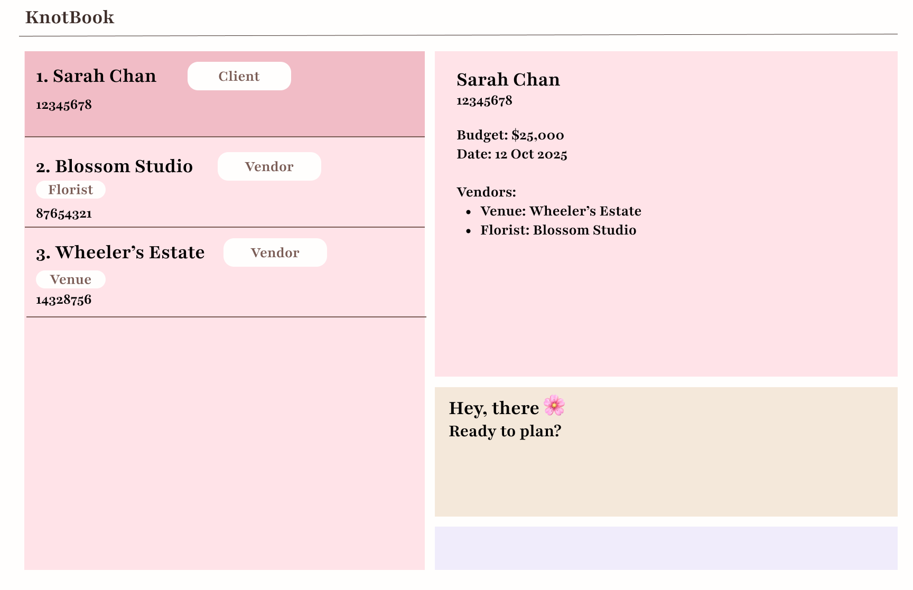
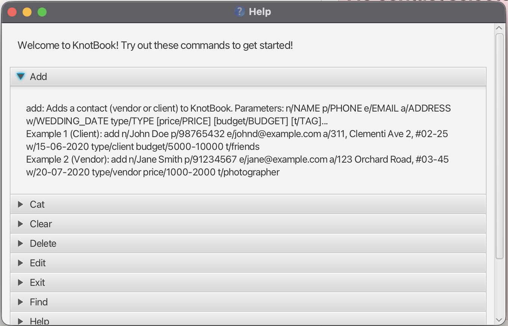

KnotBook is a **desktop app for wedding planners to manage client and vendor contacts**. It's optimized for use via typing commands (Command Line Interface/CLI) while still having the benefits of a visual interface (Graphical User Interface/GUI). If you can type fast, KnotBook can help you manage your wedding planning contacts faster than traditional apps with lots of clicking.

* Table of Contents
{:toc}

--------------------------------------------------------------------------------------------------------------------

## Quick start

### Step 1: Install Java
KnotBook needs Java 17 or newer to run. Think of Java as the engine that powers the app.

1. **Check if you already have Java:**
   - **Windows:** Open Command Prompt (search "cmd" in Start menu), type `java -version` and press Enter
   - **Mac:** Open Terminal (search "Terminal" in Spotlight), type `java -version` and press Enter
   - If you see "java version 17" or higher, you're good to go! Skip to Step 2.
   - If you see an error or a lower version, continue below.

2. **Install Java 17:**
   - **Windows/Linux:** Download from [Oracle](https://www.oracle.com/java/technologies/downloads/#java17) or [Adoptium](https://adoptium.net/)
   - **Mac:** Follow [this guide](https://se-education.org/guides/tutorials/javaInstallationMac.html) for the exact version needed

### Step 2: Download KnotBook
1. Download the latest `knotbook.jar` file from [our releases page](https://github.com/AY2526S1-CS2103T-T16-3/tp/releases)
2. Create a new folder on your computer where you want to keep KnotBook and all its data (e.g., `Documents/KnotBook`)
3. Move the downloaded `knotbook.jar` file into this folder

### Step 3: Run KnotBook
**Easy way (Double-click):**
- Simply double-click the `knotbook.jar` file
- If this doesn't work, try the command line method below

**Command line way:**
1. Open your command terminal:
   - **Windows:** Search for "Command Prompt" or "PowerShell" in the Start menu
   - **Mac:** Search for "Terminal" in Spotlight (Cmd + Space)
2. Navigate to your KnotBook folder:
   - Type `cd ` (with a space after cd)
   - Drag and drop your KnotBook folder into the terminal window
   - Press Enter
3. Run KnotBook by typing: `java -jar knotbook.jar` and press Enter

### Step 4: Start Using KnotBook
The app window should appear in a few seconds with some sample wedding contacts to help you get started.

**Try these commands** by typing them in the command box at the top and pressing Enter:

* `help` - Opens a help window showing all available commands
* `list` - Shows all your contacts (clients and vendors)
* `cat florist` - Shows only florist vendors
* `add n/Jane Smith p/91234567 e/jane@flowers.com a/123 Orchard Road type/vendor price/1500 t/florist` - Adds a new florist vendor
* `add n/John & Mary p/98765432 e/john@example.com a/311 Clementi Ave w/15-06-2026 type/client budget/10000 t/friends` - Adds a new client couple
* `delete 3` - Deletes the 3rd contact in the current list
* `exit` - Closes the app

**Need more help?** Type `help` and press Enter to see detailed instructions for all commands!

### Step 5: Understanding Your Data
- All your contact data is automatically saved in a file called `addressbook.json` in the `data` folder next to your `knotbook.jar`
- You don't need to manually save - KnotBook saves automatically after every change
- To backup your data, just copy the entire `data` folder to a safe location

--------------------------------------------------------------------------------------------------------------------

## Features

**:information_source: Notes about the command format:** 

* Words in `UPPER_CASE` are the parameters to be supplied by the user. 
  e.g. in `add n/NAME`, `NAME` is a parameter which can be used as `add n/John Doe`.

* Items in square brackets are optional. 
  e.g `n/NAME [t/TAG]` can be used as `n/John Doe t/friend` or as `n/John Doe`.

* Items with `…`​ after them can be used multiple times including zero times. 
  e.g. `[t/TAG]…​` can be used as ` ` (i.e. 0 times), `t/friend`, `t/friend t/family` etc.

* Parameters can be in any order. 
  e.g. if the command specifies `n/NAME p/PHONE_NUMBER`, `p/PHONE_NUMBER n/NAME` is also acceptable.

* Extraneous parameters for commands that do not take in parameters (such as `help`, `list`, `exit` and `clear`) will be ignored. 
  e.g. if the command specifies `help 123`, it will be interpreted as `help`.

* Dates displayed in the contacts list use the format `YYYY-MM-DD` to avoid ambiguity. Input for `w/WEDDING_DATE` accepts `DD-MM-YYYY` or `YYYY-MM-DD`.

* If you are using a PDF version of this document, be careful when copying and pasting commands that span multiple lines as space characters surrounding line-breaks may be omitted when copied over to the application.

### Viewing help : `help`

Opens a help window with detailed information about all available commands in an easy-to-navigate accordion interface.

Format: `help`

**Tip:** Click on any command name in the help window to expand and see detailed usage instructions and examples.

### Adding a contact: `add`

Adds a client or vendor contact to KnotBook.

Format: `add n/NAME p/PHONE e/EMAIL a/ADDRESS w/WEDDING_DATE type/TYPE [price/PRICE] [budget/BUDGET] [t/TAG]…​`

**Parameters:**
* `n/NAME` - Contact name (required)
* `p/PHONE` - Phone number, must be 8 digits (required)
* `e/EMAIL` - Email address (required)
* `a/ADDRESS` - Physical address (required)
* `w/WEDDING_DATE` - Wedding date in DD-MM-YYYY format (required)
* `type/TYPE` - Either `client` or `vendor` (required)
* `price/PRICE` - Vendor pricing, can be a single value or range like `1000-2000` (optional, for vendors)
* `budget/BUDGET` - Client budget, can be a single value or range like `5000-10000` (optional, for clients)
* `t/TAG` - Category tags like `florist`, `photographer`, `friends` (optional, can have multiple)

:bulb: **Tips:**
* For clients (wedding couples), include their wedding date and budget
* For vendors (service providers), include pricing and use tags to categorize them (e.g., `florist`, `caterer`, `photographer`)
* You can add multiple tags by repeating `t/TAG`

**Examples:**
* **Adding a client:** 
  `add n/John & Mary Tan p/98765432 e/john@example.com a/311 Clementi Ave 2 w/15-06-2026 type/client budget/5000-10000 t/friends`
  
* **Adding a vendor:** 
  `add n/Blooming Flowers p/91234567 e/contact@blooming.com a/123 Orchard Road w/20-07-2026 type/vendor price/1000-2000 t/florist`

### Listing all contacts : `list`

Shows a list of all contacts (both clients and vendors) in KnotBook.

Format: `list`

**Example:**
* `list` - Displays all your wedding contacts

Note: Dates shown in the contacts list are formatted as `YYYY-MM-DD` (e.g., `2026-07-15`).

### Editing a contact : `edit`

Edits an existing contact in KnotBook.

Format: `edit INDEX [n/NAME] [p/PHONE] [e/EMAIL] [a/ADDRESS] [w/WEDDING_DATE] [type/TYPE] [price/PRICE] [budget/BUDGET] [t/TAG]…​`

**How it works:**
* Edits the contact at the specified `INDEX` (the number shown in the contact list)
* The index **must be a positive integer** 1, 2, 3, …​
* At least one optional field must be provided
* Existing values will be replaced with the new input values
* When editing tags, all existing tags will be removed and replaced with the new ones
* To remove all tags, type `t/` without specifying any tags after it

**Examples:**
* `edit 1 p/91234567 e/newemail@example.com` - Updates the phone and email of the 1st contact
* `edit 2 n/Blooming Flowers Studio t/florist t/decorator` - Changes the name and replaces all tags
* `edit 3 price/1500-2500` - Updates the pricing for a vendor
* `edit 4 budget/8000` - Updates the budget for a client

### Finding contacts by name: `find`

Searches for contacts whose names contain any of the given keywords.

Format: `find KEYWORD [MORE_KEYWORDS]`

**How it works:**
* The search is case-insensitive (e.g., `hans` will match `Hans`)
* The order of keywords doesn't matter (e.g., `Hans Bo` will match `Bo Hans`)
* Only the name field is searched
* Only full words will be matched (e.g., `Han` will not match `Hans`)
* Contacts matching at least one keyword will be returned (OR search)

**Examples:**
* `find John` - Returns contacts like `john`, `John Doe`, `John & Mary`
* `find blooming garden` - Returns `Blooming Flowers`, `Garden Paradise` 

### Deleting a contact : `delete`

Deletes the specified contact from KnotBook.

Format: `delete INDEX`

**How it works:**
* Deletes the contact at the specified `INDEX`
* The index refers to the number shown in the currently displayed contact list
* The index **must be a positive integer** 1, 2, 3, …​

:exclamation: **Warning:**
This action cannot be undone! Make sure you're deleting the right contact.

**Examples:**
* `list` followed by `delete 2` - Deletes the 2nd contact in the full list
* `find Blooming` followed by `delete 1` - Deletes the 1st contact in the search results
* `cat florist` followed by `delete 3` - Deletes the 3rd florist in the filtered list

### Filtering by category : `cat`

Filters and displays contacts by their category/tag.

Format: `cat CATEGORY`

**How it works:**
* Shows only contacts with tags matching the specified category
* The search is case-insensitive (e.g., `florist` matches `Florist`)
* Useful for quickly viewing all vendors of a specific type

**Examples:**
* `cat florist` - Shows all contacts tagged as florist
* `cat photographer` - Shows all photographers
* `cat caterer` - Shows all catering services

### Linking a vendor to a client : `link`

Creates a connection between a client and a vendor, indicating that the vendor is hired for that client's wedding.

Format: `link client/CLIENT_INDEX vendor/VENDOR_INDEX`

**How it works:**
* Links the client at `CLIENT_INDEX` with the vendor at `VENDOR_INDEX`
* Both indexes refer to the numbers shown in the currently displayed list
* Both indexes **must be positive integers** 1, 2, 3, …​
* Helps you track which vendors are assigned to which weddings

**Examples:**
* `link client/1 vendor/3` - Links the 1st client with the 3rd vendor
* `link client/2 vendor/5` - Links the 2nd client with the 5th vendor

### Unlinking a vendor from a client : `unlink`

Removes the connection between a client and a vendor.

Format: `unlink client/CLIENT_INDEX vendor/VENDOR_INDEX`

**How it works:**
* Removes the link between the client at `CLIENT_INDEX` and the vendor at `VENDOR_INDEX`
* Useful when a vendor is changed or a service is cancelled

**Examples:**
* `unlink client/1 vendor/3` - Removes the link between the 1st client and 3rd vendor
* `unlink client/2 vendor/5` - Removes the link between the 2nd client and 5th vendor

### Clearing all entries : `clear`

Clears all contacts from KnotBook.

Format: `clear`

:exclamation: **Warning:**
This will delete ALL your contacts permanently! Make sure to backup your data first.

### Exiting the program : `exit`

Exits the program.

Format: `exit`

### Saving the data

KnotBook data is saved to your hard disk automatically after any command that changes the data. There is no need to save manually.

### Editing the data file

KnotBook data is saved automatically as a JSON file `[JAR file location]/data/addressbook.json`. Advanced users are welcome to update data directly by editing that data file.

:exclamation: **Caution:**
If your changes to the data file make its format invalid, KnotBook will discard all data and start with an empty data file at the next run. Hence, it is recommended to take a backup of the file before editing it. 
Furthermore, certain edits can cause KnotBook to behave in unexpected ways (e.g., if a value entered is outside of the acceptable range). Therefore, edit the data file only if you are confident that you can update it correctly.

### Archiving data files `[coming in v2.0]`

_Details coming soon ..._

--------------------------------------------------------------------------------------------------------------------

## FAQ

**Q**: How do I transfer my data to another computer? 
**A**: Install KnotBook on the other computer, then copy the `data` folder from your old computer to the new KnotBook folder, replacing the new `data` folder.

**Q**: What's the difference between a client and a vendor? 
**A**: A **client** is a couple planning their wedding (your customers). A **vendor** is a service provider like a florist, caterer, or photographer.

**Q**: Can I add a contact without a wedding date? 
**A**: No, the wedding date field (`w/`) is required for all contacts. This helps you track and organize weddings by their dates.

**Q**: How do I see which vendors are linked to a specific client? 
**A**: Click on a client contact in the list to view their details, which will show all linked vendors.

**Q**: Can I use KnotBook offline? 
**A**: Yes! KnotBook works completely offline and doesn't require an internet connection.

--------------------------------------------------------------------------------------------------------------------

## Known issues

1. **When using multiple screens**, if you move the application to a secondary screen, and later switch to using only the primary screen, the GUI will open off-screen. The remedy is to delete the `preferences.json` file created by the application before running the application again.
2. **If you minimize the Help Window** and then run the `help` command again, the original Help Window will remain minimized, and no new Help Window will appear. The remedy is to manually restore the minimized Help Window.
3. **Phone numbers** must be 8 digits. If you need to store international numbers with special characters, you may need to remove the formatting (e.g., use `6591234567` instead of `+65 9123 4567`).

--------------------------------------------------------------------------------------------------------------------

## Command summary

Action | Format, Examples
--------|------------------
**Add Client** | `add n/NAME p/PHONE e/EMAIL a/ADDRESS w/WEDDING_DATE type/client [budget/BUDGET] [t/TAG]…​`   e.g., `add n/John & Mary p/98765432 e/john@example.com a/311 Clementi Ave w/15-06-2026 type/client budget/10000 t/friends`
**Add Vendor** | `add n/NAME p/PHONE e/EMAIL a/ADDRESS w/WEDDING_DATE type/vendor [price/PRICE] [t/TAG]…​`   e.g., `add n/Blooming Flowers p/91234567 e/contact@blooming.com a/123 Orchard Rd w/20-07-2026 type/vendor price/1500 t/florist`
**List** | `list` - Shows all contacts
**Find** | `find KEYWORD [MORE_KEYWORDS]`  e.g., `find John Blooming`
**Filter by Category** | `cat CATEGORY`  e.g., `cat florist`
**Edit** | `edit INDEX [n/NAME] [p/PHONE] [e/EMAIL] [a/ADDRESS] [w/WEDDING_DATE] [type/TYPE] [price/PRICE] [budget/BUDGET] [t/TAG]…​`  e.g., `edit 2 p/91234567 budget/8000`
**Delete** | `delete INDEX`  e.g., `delete 3`
**Link** | `link client/CLIENT_INDEX vendor/VENDOR_INDEX`  e.g., `link client/1 vendor/3`
**Unlink** | `unlink client/CLIENT_INDEX vendor/VENDOR_INDEX`  e.g., `unlink client/1 vendor/3`
**Clear** | `clear` - Deletes all contacts
**Help** | `help` - Opens help window
**Exit** | `exit` - Closes the application
