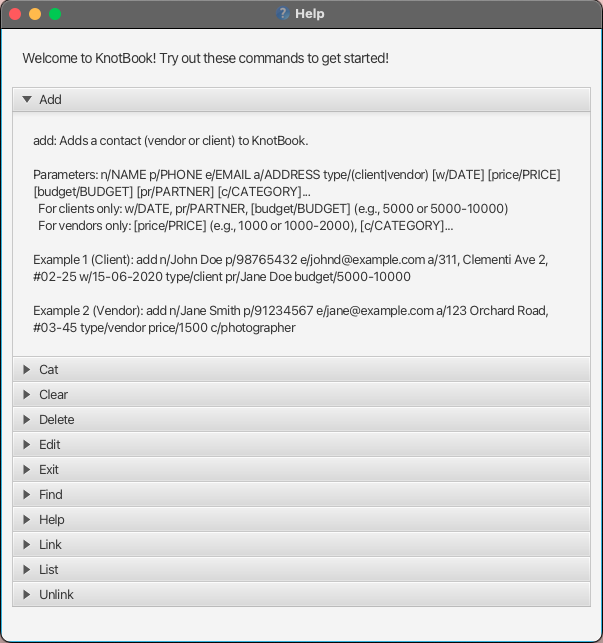
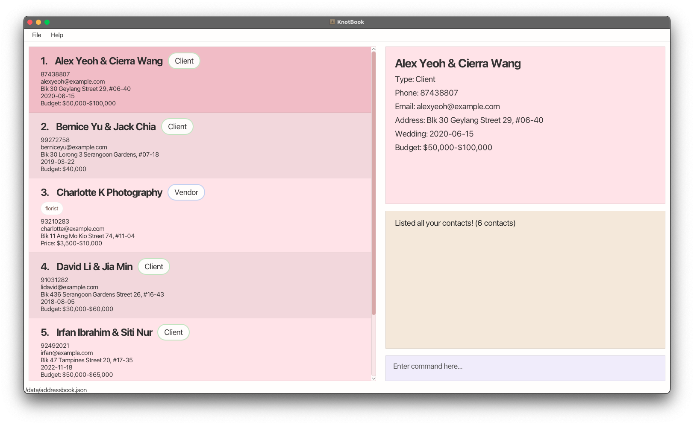
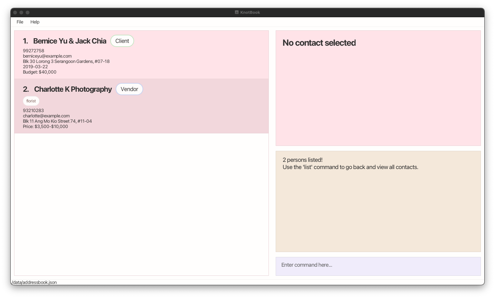
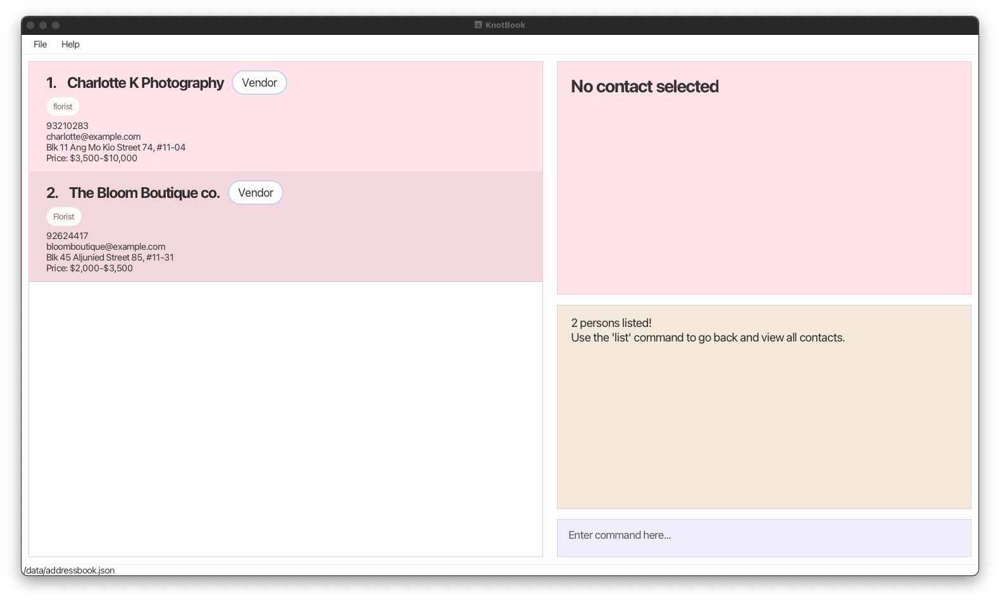
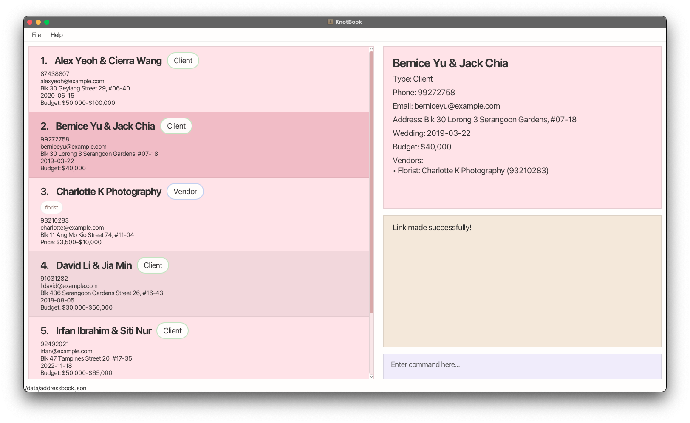
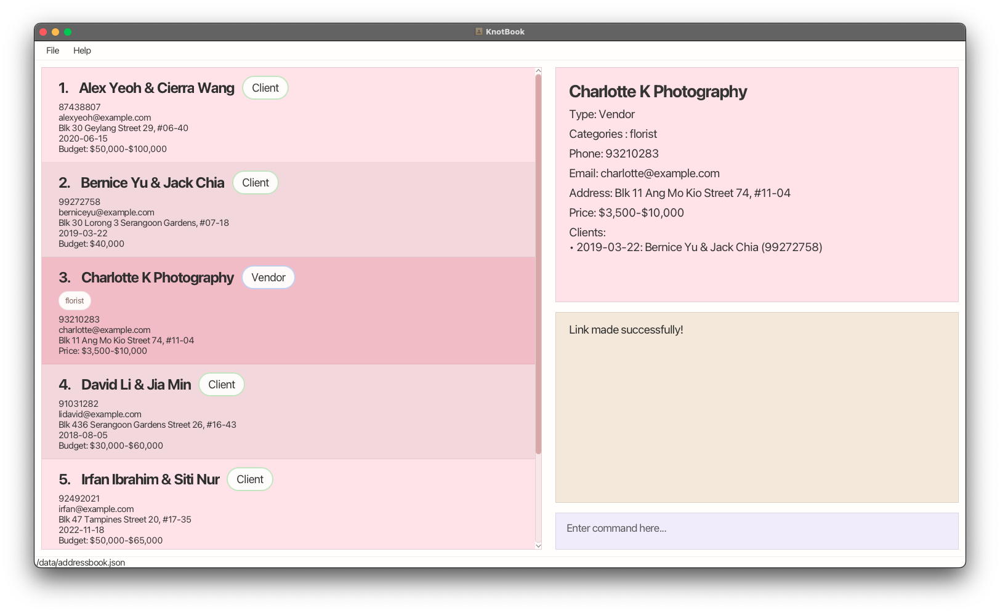

# KnotBook User Guide
KnotBook is a desktop app designed exclusively for **wedding planners** to manage client and vendor contacts, keeping track of every wedding and connection you coordinate throughout your planning journey. As a wedding planner, you can add new clients and vendors to the app via a simple to use **Command Line Interface (CLI)**. Furthermore, you can link vendors to clients, edit contact details, and organize everything in one centralized place. You will never lose track of which florist is working on which wedding or miss important client details after using KnotBook!

* Table of Contents
{:toc}
--------------------------------------------------------------------------------------------------------------------
## Quick start

### Step 1: Install Java
KnotBook needs Java 17 or newer to run. Think of Java as the engine that powers the app.

1. **Check if you already have Java:**
   - **Windows:** Open Command Prompt (search "cmd" in Start menu), type `java -version` and press Enter.
   - **Mac:** Open Terminal (search "Terminal" in Spotlight) (open Spotlight by simply pressing Command + Spacebar), type `java -version` and press Enter.
   - If you see "java version 17" or higher, you're good to go! Skip to Step 2.
   - If you see an error or a lower version, continue below.

2. **Install Java 17:**
   - **Windows/Linux:** Download from [Oracle](https://www.oracle.com/java/technologies/downloads/#java17)
   - **Mac:** Follow [this guide](https://se-education.org/guides/tutorials/javaInstallationMac.html) for the exact version needed

### Step 2: Download KnotBook
1. Download the latest `KnotBook.jar` file from [our releases page](https://github.com/AY2526S1-CS2103T-T16-3/tp/releases): scroll down until you see the latest "Assets" section, then simply click on `KnotBook.jar` to download it
2. Create a new folder on your computer where you want to keep KnotBook and all its data (e.g., `Documents/KnotBook`)
3. Move the downloaded `KnotBook.jar` file into this folder

### Step 3: Run KnotBook
**Easy way (Double-click):**
- Simply double-click the `KnotBook.jar` file
- If this doesn't work, try the command line method below

**Command line way:**
1. Open your command terminal:
   - **Windows:** Search for "Command Prompt" or "PowerShell" in the Start menu
   - **Mac:** Search for "Terminal" in Spotlight (Cmd + Space)
2. Navigate to your KnotBook folder:
   - Type `cd ` (with a space after cd)
   - Drag and drop your KnotBook folder into the terminal window
   - Press Enter
3. Run KnotBook by typing: `java -jar knotbook.jar` and press Enter

### Step 4: Start Using KnotBook
The app window should appear in a few seconds with some sample wedding contacts to help you get started.

**Try these commands** by typing them in the command box at the top and pressing Enter:
* `help` - Opens a help window showing all available commands
* `list` - Shows all your contacts (clients and vendors)
* `cat florist` - Shows only vendors categorized as florist
* `add n/Jane Smith p/91234567 e/jane@flowers.com a/123 Orchard Road type/vendor price/1500 c/florist` - Adds a new florist vendor
* `add n/John Doe p/98765432 e/johnd@example.com a/311 Clementi Ave type/client w/15-06-2026 pr/Jane Doe budget/9000-10000` - Adds a new client couple
* `delete 3` - Deletes the 3rd contact in the current list
* `exit` - Closes the app

**Need more help?** Type `help` and press Enter to see detailed instructions for all commands!

### Step 5: Understanding Your Data
- All your contact data is automatically saved in a file called `addressbook.json` in the `data` folder next to your `knotbook.jar`
- You don't need to manually save - KnotBook saves automatically after every change
- To backup your data, just copy the entire `data` folder to a safe location

:exclamation: **Caution:**
IMPORTANT: Take note that you should only use our app to edit your data and never edit the JSON file in your directory directly.

--------------------------------------------------------------------------------------------------------------------

## Command summary

Action | Format, Examples
--------|------------------
**Add Client** | `add n/NAME p/PHONE e/EMAIL a/ADDRESS type/client w/WEDDING_DATE pr/PARTNER [budget/BUDGET]​`   e.g., `add n/John Doe p/98765432 e/johnd@example.com a/311 Clementi Ave type/client w/15-06-2026 pr/Jane Doe budget/10000`
**Add Vendor** | `add n/NAME p/PHONE e/EMAIL a/ADDRESS type/vendor [price/PRICE] [c/CATEGORY]​`   e.g., `add n/Blooming Flowers p/91234567 e/contact@blooming.com a/123 Orchard Rd type/vendor price/1500 c/florist`
**List All Contacts** | `list`
**Find a Contact** | `find KEYWORD`  e.g., `find John Blooming`
**Filter by Category** | `cat CATEGORY`  e.g., `cat florist`
**Edit Contact** | `edit INDEX [n/NAME] [p/PHONE] [e/EMAIL] [a/ADDRESS] [w/WEDDING_DATE] [pr/PARTNER] [price/PRICE] [budget/BUDGET] [c/CATEGORY]​`  e.g., `edit 2 p/91234567 budget/8000`
**Delete Contact** | `delete INDEX`  e.g., `delete 3`
**Link Client with Vendor** | `link client/CLIENT_INDEX vendor/VENDOR_INDEX`  e.g., `link client/1 vendor/3`
**Unlink Client with Vendor** | `unlink client/CLIENT_INDEX vendor/VENDOR_INDEX`  e.g., `unlink client/1 vendor/3`
**Clear** | `clear` - Deletes all contacts
**Help** | `help` - Opens help window
**Exit** | `exit` - Closes the application

--------------------------------------------------------------------------------------------------------------------

## Features

**:information_source: Notes about the command format:** 

* Words in `UPPER_CASE` are the parameters to be supplied by the user. 
  e.g. in `add n/NAME`, `NAME` is a parameter which can be used as `add n/John Doe`.

* Items in square brackets are optional. 
  e.g `n/NAME [c/CATEGORY]` can be used as `n/The Bloom Boutique c/florise` or as `n/The Bloom Boutique`.

* For all commands, the command word is case-sensitive.

* Parameters can be in any order. 
  e.g. if the command specifies `n/NAME p/PHONE_NUMBER`, `p/PHONE_NUMBER n/NAME` is also acceptable.

* Extraneous parameters for commands that do not take in parameters (such as `help`, `list`, `exit` and `clear`) will be ignored. 
  e.g. if the command specifies `help 123`, it will be interpreted as `help`.

* Dates displayed in the contacts list use the format `YYYY-MM-DD` to avoid ambiguity. Input for `w/WEDDING_DATE` accepts `DD-MM-YYYY` or `YYYY-MM-DD`.
  
* Commands must be entered on a single line. Newlines are not supported. 
  If you copy a command that appears on multiple lines, join it into one line before pressing Enter.
  Pasting multi-line commands into the command box will fail; replace line breaks with spaces.

* Dates displayed in the contacts list use the format `YYYY-MM-DD` to avoid ambiguity. Input for `w/WEDDING_DATE` accepts `DD-MM-YYYY` or `YYYY-MM-DD`.

* If you are using a PDF version of this document, be careful when copying and pasting commands that span multiple lines as space characters surrounding line-breaks may be omitted when copied over to the application.

### Viewing help : `help` 💡

Opens a help window with detailed information about all available commands in an easy-to-navigate accordion interface.

Format: `help`

**Tip:** Click on any command name in the help window to expand and see detailed usage instructions and examples.

### Adding a contact: `add` 👯‍♀️

* Clients: When a new couple signs with you, use this to create their client profile in KnotBook!
* Vendors: When you onboard a vendor (e.g., photographer, florist, venue), use this command to add their vendor profile!

**Format for adding a client:**
`add n/NAME p/PHONE e/EMAIL a/ADDRESS type/client w/WEDDING_DATE pr/PARTNER [budget/BUDGET]​`

**Format for adding a vendor:**
`add n/NAME p/PHONE e/EMAIL a/ADDRESS type/vendor [price/PRICE] [c/CATEGORY]​`

**Parameters:**
* `n/NAME` - Contact name (required)
  * Can contain alphanumeric characters, spaces, and special characters like commas (`,`), slashes (`/`), ampersands (`&`), hyphens (`-`), and apostrophes (`'`)
  * Must start with an alphanumeric character
  * Example: `John Chia`, `O'Brien Catering`, `Bloom & Co.`
* `p/PHONE` - Phone number (required)
  * Must be exactly 8 digits
  * No letters, spaces, hyphens, or other special characters allowed
  * Example: `91234567`, `98765432`
* `e/EMAIL` - Email address (required)
    * Must follow standard internet email format (specifically RFC 5322 standard), meaning:
       * Must contain exactly one `@` symbol
       * Must have a valid domain (e.g., `.com`, `.net`, `.sg`)
       * No spaces
    * Example: `john@example.com`, `contact.us@blooming-flowers.sg`
    * *Technical details:* KnotBook uses [Apache Commons Validator EmailValidator](https://commons.apache.org/proper/commons-validator/apidocs/org/apache/commons/validator/routines/EmailValidator.html)
* `a/ADDRESS` - Physical address (required)
  * Can contain any characters
  * Example: `123 Orchard Road, #05-01`
* `type/TYPE` - Either `client` or `vendor` (required, case-insensitive)
* `w/WEDDING_DATE` - Wedding date (required, for clients only)
  * Accepts formats: `DD-MM-YYYY` or `YYYY-MM-DD`
  * Must be a valid, real date whereby
     * `DD` ranges from `01` to either `28` or `29` for February (depending on leap years), and to `30` or `31` (depending on the month) for other months
     * `MM` ranges from `01` to `12`
     * `YYYY` ranges from `0000` to `9999` (only four-digit years supported)
  * Example: `15-06-2026` or `2026-06-15`
* `pr/PARTNER` - Partner name (required, for clients only)
  * Can contain alphanumeric characters, spaces, and special characters like commas (`,`), slashes (`/`), ampersands (`&`), hyphens (`-`), and apostrophes (`'`)
  * Must start with an alphanumeric character
  * Example: `Jane Wang`
* `price/PRICE` - Vendor pricing (optional, for vendors only)
  * Must be a positive integer (whole numbers only, no cents/decimals, no commas and no fullstops)
  * Can be a single value (e.g., `1000`) or range (e.g., `1000-2000`)
  * Range values must be separated by a hyphen with no spaces
  * Maximum value: 999,999,999
* `budget/BUDGET` - Client budget (optional, for clients only)
  * Must be a positive integer (whole numbers only, no cents/decimals, no commas and no fullstops)
  * Can be a single value (e.g., `5000`) or range (e.g., `5000-10000`)
  * Range values must be separated by a hyphen with no spaces
  * Maximum value: 999,999,999
* `c/CATEGORY` - Category tags (optional, for vendors only)
  * Must start with an alphanumeric character
  * Can contain spaces, hyphens (`-`), ampersands (`&`), periods (`.`), apostrophes (`'`), slashes (`/`), and parentheses (`()`)
  * Limit of 30 characters and a minimum of 2 characters
  * Example: `makeup artist`, `photographer`

**Note:**
* When you type in an `add` command after a `find` command, the displayed list will reset from the filtered results.
* The name of the contact is case-sensitive so Blooming Bouquets and BLOOMING Bouquets are treated as 2 different contacts; Be careful in inputting names!

**Duplicate contacts:**
* If a new contact has a phone that already exists in KnotBook, the add will be rejected. This is because we assume each person has a unique phone number. 
* Clients and vendors share the same pool. You can’t have a client and a vendor with the same phone number.

:bulb: **Tips:**
* For clients (wedding couples), wedding date and partner name is required. You can also include their budget.
* For vendors (service providers), you may include pricing and use categories to classify them (e.g., `florist`, `makeup artist`, `photographer`)

**Examples:**
* **Adding a client:** 
  `add n/John Doe p/98765432 e/johnd@example.com a/311, Clementi Ave 2, #02-25 type/client w/15-06-2026 pr/Jane Doe budget/5000-10000`

* **Adding a vendor:** 
  `add n/Blooming Flowers p/91234567 e/contact@blooming.com a/123 Orchard Road type/vendor price/1000-2000 c/florist`

### Listing all contacts : `list` 📜

Shows a list of all contacts (both clients and vendors) in KnotBook.

Format: `list` 

**Example:**
* `list` - Displays all your wedding contacts

Note: Dates shown in the contacts list are formatted as `YYYY-MM-DD` (e.g., `2026-07-15`).

### Editing a contact : `edit` ✍️

Made a typo? Client changed their wedding date? Vendor updated their pricing? Use this command to quickly update any contact details in KnotBook!

Format: `edit INDEX [n/NAME] [p/PHONE] [e/EMAIL] [a/ADDRESS] [w/WEDDING_DATE] [type/TYPE] [pr/PARTNER] [price/PRICE] [budget/BUDGET] [c/CATEGORY]​`

**How it works:**
* Edits the contact at the specified `INDEX` (the number shown in the contact list)
* The index **must be a positive integer** (1, 2, 3, …) and **must not exceed the total number of contacts** in the displayed list
* At least one optional field must be provided
* Existing values will be replaced with the new input values
* To remove a category, type `c/` without specifying any categories after it
* When you type in an `edit` command after a `find` or `cat` command, you can only edit from the filtered contacts.

**Examples:**
* `edit 1 p/91234567 e/newemail@example.com` - Updates the phone and email of the 1st contact
* `edit 2 n/Blooming Flowers Studio c/florist` - Updates the name and category of the 2nd contact
* `edit 3 price/1500-2500` - Updates the pricing for a vendor
* `edit 4 budget/8000` - Updates the budget for a client

### Finding contacts by name: `find` 🔍

Looking for a specific client or vendor? Quickly search by name - and for clients, the search also checks the partner’s name - with this handy command!

Format: `find KEYWORD`

**How it works:**
* The search is case-insensitive (e.g., `hans` will match `Hans`)
* The entire input is treated as one query. Spaces are not split into separate keywords (e.g., `roy b` is treated as the single query `"roy b"`).
* Only the name field is searched; for clients, the partner’s name is also checked.
* Matches the start of any word (first name, last name, etc.). It’s **prefix**, not substring (e.g., `Han` matches `Hans`, but `an` does not match `Hans`).

**Examples:**
* `find tan` - Returns contacts like `Alex Tan`, `Tan Wei Ling`; also matches a client whose partner is Tan Jun Hao.
* `find ch` - Returns `Charlotte K Photography`; also matches a client whose partner is `Jack Chia`. 

:bulb: **Tips:**
<ul>
  <li>After using <code>find</code>, run <code>list</code> to show all contacts again.</li>
  <li><code>link</code>/<code>unlink</code> use the currently displayed list - if unsure, <code>list</code> first.</li>
</ul>

### Filtering by category : `cat`  🏷️

Need to find a photographer for an upcoming wedding? Want to see all your caterers at once? Filter contacts by category to instantly view all vendors of a specific type!

Format: `cat CATEGORY`

**How it works:**
* Shows only contacts with categories matching the specified category
* The search is case-insensitive (e.g., `florist` matches `Florist`)
* Useful for quickly viewing all vendors of a specific type

**Examples:**
* `cat florist` - Shows all vendors categorized as florist
* `cat photographer` - Shows all photographers
* `cat caterer` - Shows all catering services

:bulb: <strong>Tips:</strong>
  <ul>
    <li><strong>Only vendors</strong> have categories - clients won’t show up in <code>cat</code> results.</li>
    <li>Category matching is <strong>case-insensitive</strong>.</li>
    <li>In a filtered view (after <code>cat</code> or <code>find</code>), commands like <code>delete INDEX</code> use the index from the <em>filtered list</em>.</li>
    <li>To reset the view, run <code>list</code>.</li>
  </ul>

### Linking a vendor to a client : `link` 🔗

Hired a photographer for the Johnson wedding? Use this command to connect vendors with their clients, so you can easily track which vendors are working on which weddings!

Format: `link client/CLIENT_INDEX vendor/VENDOR_INDEX`

**How it works:**
* Links the client at `CLIENT_INDEX` with the vendor at `VENDOR_INDEX`
* Both indexes refer to the numbers shown in the currently displayed list
* Both indexes **must be a positive integer** (1, 2, 3, …) and **must not exceed the total number of contacts** in the displayed list
* Helps you track which vendors are assigned to which weddings

**Examples:**
* `link client/1 vendor/3` - Links the 1st client with the 3rd vendor
* `link client/2 vendor/5` - Links the 2nd client with the 5th vendor

### Unlinking a vendor from a client : `unlink` ⛓️‍💥

Client switched photographers? Vendor cancelled? Use this command to remove the connection between a client and vendor when plans change.

Format: `unlink client/CLIENT_INDEX vendor/VENDOR_INDEX`

**How it works:**
* Removes the link between the client at `CLIENT_INDEX` and the vendor at `VENDOR_INDEX`
* Useful when a vendor is changed or a service is cancelled

**Examples:**
* `unlink client/1 vendor/3` - Removes the link between the client at index 1 and vendor at index 3
* `unlink client/2 vendor/5` - Removes the link between the client at index 2 and vendor at index 3

:exclamation: <strong>Warning:</strong>
Both <code>CLIENT_INDEX</code> and <code>VENDOR_INDEX</code> refer to the <em>currently displayed</em> list (after <code>find</code> or <code>cat</code> as well). 
Ensure the chosen indices point to a <strong>client</strong> and a <strong>vendor</strong> respectively, or the command will fail.

:bulb: <strong>Tips for link/unlink:</strong>
<ul>
  <li>After using <code>find</code> or <code>cat</code>, run <code>list</code> to reset the view if you’re unsure about indices.</li>
  <li>You can pick indices from any filtered view (e.g., <code>find tan</code> then <code>link client/1 vendor/2</code>) - the indices come from that filtered list.</li>
  <li><strong>link:</strong> If the client and vendor are already linked, running <code>link</code> again will show an “already linked” message.</li>
  <li><strong>unlink:</strong> If the pair isn’t currently linked, <code>unlink</code> will show a “not linked” message.</li>
  <li>Both commands update <em>both</em> records (the client’s linked vendors and the vendor’s linked clients stay in sync).</li>
</ul>

### Deleting a contact : `delete` 🗑️

Need to remove a contact? Whether a vendor is no longer available or a client cancelled, use this command to delete any contact from KnotBook.

Format: `delete INDEX`

**How it works:**
* Deletes the contact at the specified `INDEX`
* The index refers to the number shown in the currently displayed contact list
* The index **must be a positive integer** (1, 2, 3, …) and **must not exceed the total number of contacts** in the displayed list

:exclamation: **Warning:**
This action cannot be undone! Make sure you're deleting the right contact.

:bulb: <strong>Tips:</strong>
<ul>
  <li>Run <code>list</code> first to reset the view, then delete by the index you see.</li>
  <li>Indices refer to the <em>currently displayed</em> list (after <code>find</code>, <code>cat</code>, etc.).</li>
  <li>If a contact is linked, consider <code>unlink</code> first so you’re sure which records remain.</li>
</ul>

**Examples:**
* `list` followed by `delete 2` - Deletes the 2nd contact in the full list
* `find Blooming` followed by `delete 1` - Deletes the 1st contact in the search results
* `cat florist` followed by `delete 3` - Deletes the 3rd contact in the filtered list

### Clearing all entries : `clear` 🧹

Need a clean slate? This command deletes ALL contacts from KnotBook at once.

Format: `clear`

:exclamation: **Warning:**
This will delete ALL your contacts permanently! Make sure to backup your data first.

### Exiting the program : `exit` 👋

All done for the day? Use this command to close KnotBook!

Format: `exit`

### Saving the data

KnotBook data is saved to your hard disk automatically after any command that changes the data. There is no need to save manually.

### Editing the data file

KnotBook data is saved automatically as a JSON file `[JAR file location]/data/addressbook.json`.

--------------------------------------------------------------------------------------------------------------------

## FAQ

**Q**: How do I transfer my data to another computer? 
**A**: Install KnotBook on the other computer, then copy the `data` folder from your old computer to the new KnotBook folder, replacing the new `data` folder.

**Q**: What's the difference between a client and a vendor? 
**A**: A **client** is a couple planning their wedding (your customers). A **vendor** is a service provider like a florist, caterer, or photographer.

**Q**: How do I see which vendors are linked to a specific client? 
**A**: Click on a client contact in the list to view their details, which will show all linked vendors.

**Q**: Can I use KnotBook offline? 
**A**: Yes! KnotBook works completely offline and doesn't require an internet connection.

--------------------------------------------------------------------------------------------------------------------

## Known issues

1. **When using multiple screens**, if you move the application to a secondary screen, and later switch to using only the primary screen, the GUI will open off-screen. The remedy is to delete the `preferences.json` file created by the application before running the application again.
2. **If you minimize the Help Window** and then run the `help` command again, the original Help Window will remain minimized, and no new Help Window will appear. The remedy is to manually restore the minimized Help Window.

--------------------------------------------------------------------------------------------------------------------

